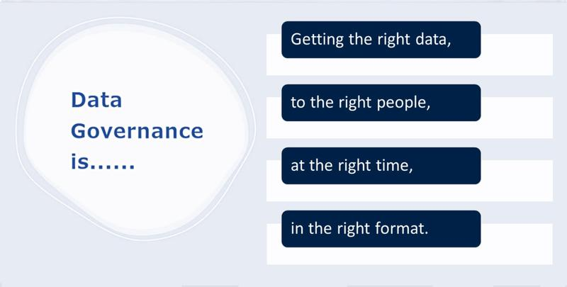
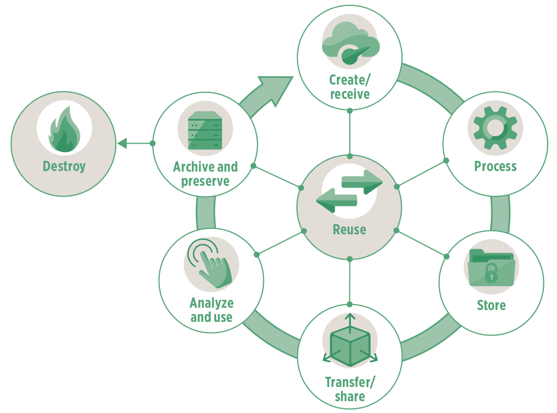
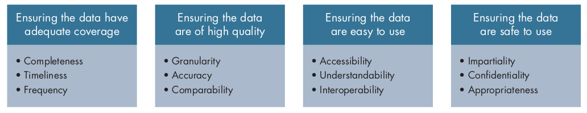
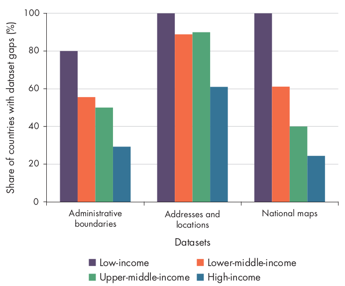
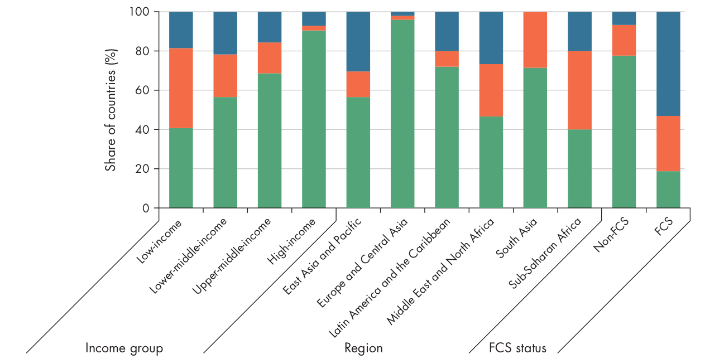
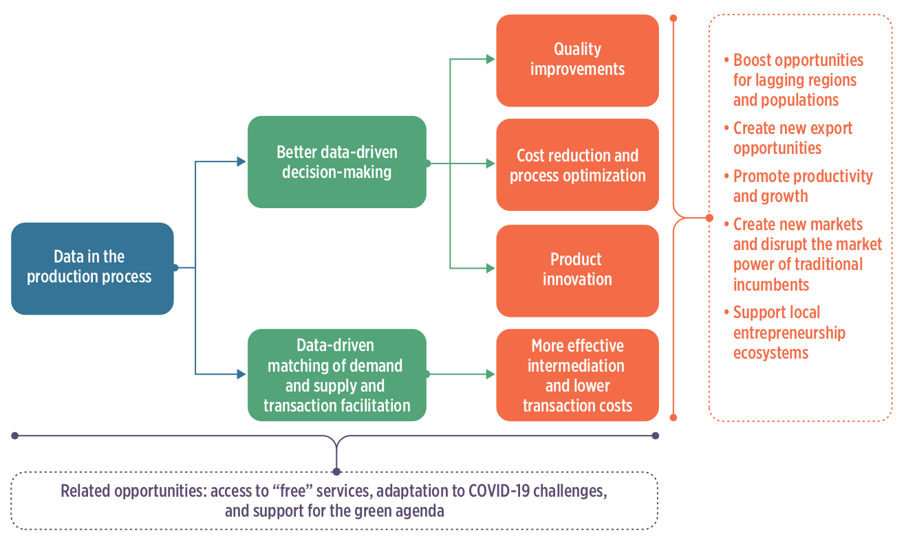
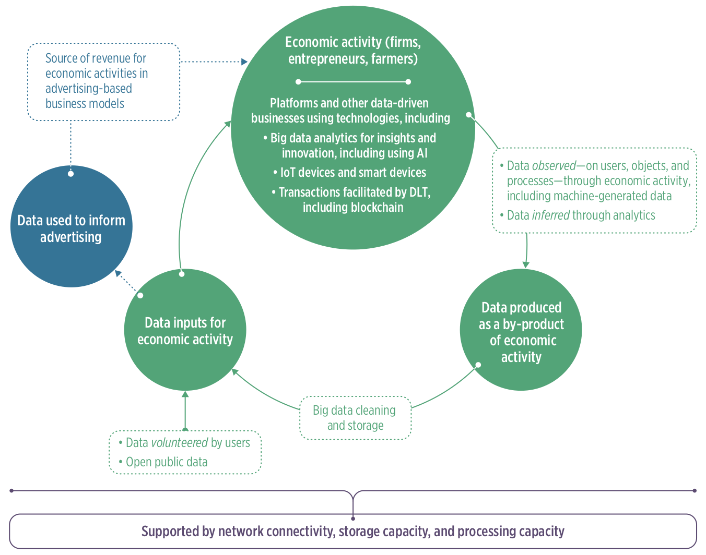
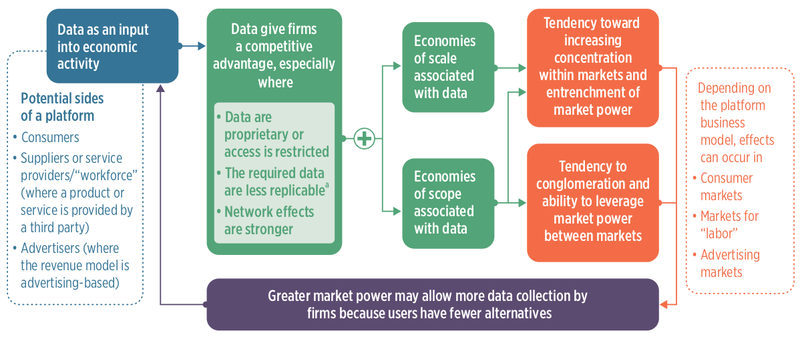

## Định nghĩa {.center background-color="#002147"}

::: {.notes}

Trong 4 slide tiếp theo, tôi sẽ trình bày một số khái niệm và định nghĩa cơ bản được đề xuất, làm nền tảng cho các phần còn lại của buổi học hôm nay.

:::

## Dữ liệu là gì? {.center}

::: {.r-fit-text}

"Khi chúng ta đề cập đến dữ liệu, chúng ta đang nói đến thông tin về **con người**, **sự vật** và **hệ thống**. ... Dữ liệu về con người có thể bao gồm **dữ liệu cá nhân**, như *thông tin liên hệ cơ bản*, hồ sơ được tạo ra thông qua *tương tác với dịch vụ* hoặc *web*, hoặc thông tin về *đặc điểm sinh học  (biometrics)* - và cũng có thể mở rộng đến **dữ liệu cấp độ dân số**, như *thống kê dân số*. Dữ liệu cũng có thể liên quan đến **hệ thống và cơ sở hạ tầng**, chẳng hạn như *hồ sơ hành chính* về doanh nghiệp và dịch vụ công. Dữ liệu ngày càng được sử dụng để mô tả **vị trí**, chẳng hạn nhưchi tiết *tham chiếu không gian địa lý*, và *môi trường* chúng ta sống, chẳng hạn như dữ liệu về *đa dạng sinh học* hoặc thời *tiết*. Nó cũng có thể đề cập đến thông tin được tạo ra bởi *mạng lưới cảm biến* càng phát triển tạo nên *Internet of Things*."

:::

                           - Chiến lược Dữ liệu Quốc gia của Vương quốc Anh

::: {.notes}

Dữ liệu đề cập đến thông tin về con người, hệ thống và thế giới xung quanh chúng ta. Nó bao gồm thông tin cá nhân và thông tin cấp độ dân số về cá nhân, hồ sơ về tổ chức và dịch vụ công, cũng như dữ liệu mô tả vị trí và môi trường. Nó cũng bao gồm thông tin được tạo ra từ các tương tác kỹ thuật số và công nghệ kết nối như cảm biến và Internet of Things.

:::

## Quản trị dữ liệu là gì? {.center}

:::: {.columns}

::: {.column width="50%"}

Một hệ thống **khung pháp lý vững chắc**, **hướng dẫn đạo đức**, **tiêu chuẩn** và **quy trình** đảm bảo rằng dữ liệu của tổ chức luôn **chính xác**, **nhất quán**, **an toàn** và **tuân thủ** trong suốt vòng đời của nó.

:::

::: {.column width="50%"}

{width="600px" fig-align="center"}

:::

::::

::: {.notes}

Một hệ thống khung pháp lý vững chắc, hướng dẫn đạo đức, tiêu chuẩn và quy trình đảm bảo dữ liệu của tổ chức luôn chính xác, nhất quán, an toàn và tuân thủ trong suốt vòng đời của nó.

Cung cấp dữ liệu chính xác đến đúng người, vào đúng thời điểm và dưới đúng định dạng.

:::

## Vòng đời dữ liệu là gì? {.center}

{fig-align="center"}

::: {.notes}

Vòng đời dữ liệu mô tả các giai đoạn mà dữ liệu trải qua từ khi được tạo ra cho đến khi bị loại bỏ. Mặc dù các mô hình có thể khác nhau, nhưng nó thường bao gồm các giai đoạn chính sau:

Tạo ra / Thu thập – Dữ liệu được tạo ra hoặc thu thập từ các nguồn như con người, hệ thống, cảm biến hoặc khảo sát.

Xử lý – Dữ liệu được làm sạch, xác thực, tổ chức và chuyển đổi thành định dạng có thể sử dụng.

Lưu trữ – Dữ liệu được lưu trữ an toàn trong cơ sở dữ liệu, kho dữ liệu hoặc các hệ thống khác.

Sử dụng / Phân tích – Dữ liệu được truy cập, phân tích và sử dụng để tạo ra thông tin chi tiết, hỗ trợ quyết định hoặc cung cấp dịch vụ.

Chia sẻ / Công bố – Dữ liệu được chia sẻ với các bên khác, cả nội bộ và bên ngoài, tuân thủ các yêu cầu pháp lý, đạo đức và an ninh.

Lưu trữ / Bảo quản – Dữ liệu không còn được sử dụng tích cực sẽ được bảo quản cho mục đích pháp lý, lịch sử hoặc tham khảo.

Xử lý / Xóa bỏ – Dữ liệu được tiêu hủy hoặc xóa bỏ một cách an toàn khi không còn cần thiết.

Ở tất cả các giai đoạn, quản trị, an ninh, quyền riêng tư và quản lý chất lượng được áp dụng để đảm bảo dữ liệu được sử dụng một cách có trách nhiệm và hiệu quả.

Vòng đời dữ liệu thể hiện tính tuần hoàn tiềm năng của việc sử dụng, tái sử dụng và tái mục đích dữ liệu, miễn là dữ liệu có thể được truy cập an toàn bởi nhiều người dùng và trừ khi có các bước cụ thể để tiêu hủy dữ liệu. Điều này thể hiện tính không cạn kiệt/không thể so sánh của dữ liệu – chúng có thể được sử dụng và tái sử dụng nhiều lần bởi các công ty và chính phủ cho các mục đích khác nhau mà không làm cạn kiệt chúng. Do đó, tiềm năng khai thác giá trị từ dữ liệu là rất lớn.

:::

## Dữ liệu ý định công khai so với dữ liệu ý định riêng tư {.center background-color="#002147"}

::: {.notes}

Chúng ta sẽ định nghĩa và phân biệt các khái niệm về dữ liệu ý định công khai và dữ liệu ý định riêng tư.

:::

## {.center}

:::: {.columns}

::: {.column width="50%"}

### Dữ liệu ý định công khai

- Dữ liệu ý định công khai là dữ liệu được thu thập cho mục đích công cộng.

- Dữ liệu ý định công khai là nền tảng của các chính sách công và có thể đóng vai trò chuyển đổi trong khu vực công.

:::

::: {.column width="50%"}

### Dữ liệu ý định riêng tư

- Dữ liệu ý định riêng tư là dữ liệu được thu thập bởi khu vực tư nhân trong quá trình hoạt động kinh doanh thông thường.

- Dữ liệu ý định tư nhân có thể thúc đẩy đổi mới, giảm chi phí giao dịch và nâng cao năng suất, khả năng cạnh tranh và tăng trưởng kinh tế.

:::

::::

::: {.notes}

Dữ liệu ý định công là dữ liệu được thu thập để phục vụ lợi ích công cộng, đặc biệt là cho việc phát triển, triển khai và đánh giá chính sách công. Chính phủ là nguồn sản xuất chính của dữ liệu này thông qua các hoạt động như điều tra dân số, khảo sát và hồ sơ hành chính, nhưng nó cũng được đóng góp bởi công dân, xã hội dân sự, các tổ chức phi chính phủ, các tổ chức học thuật và quốc tế, và trong một số trường hợp, các doanh nghiệp tư nhân.

Dữ liệu ý định tư nhân là dữ liệu được thu thập bởi khu vực tư nhân như một phần của các quy trình kinh doanh thông thường. Những dữ liệu này thường được gọi là dấu vết kỹ thuật số - như lượt truy cập trang web, tìm kiếm, tải xuống nội dung và hoạt động trên mạng xã hội - tiết lộ sở thích, nhu cầu và ý định mua hàng cụ thể của một cá nhân hoặc công ty, giúp doanh nghiệp cá nhân hóa tiếp thị, xác định các khách hàng tiềm năng có giá trị cao và dự đoán hành vi mua hàng, mặc dù việc thu thập và sử dụng dữ liệu này gây ra các vấn đề về quyền riêng tư và yêu cầu xử lý đạo đức cẩn thận và sự đồng ý.

:::

## Hoạt động 1: Hãy cho tôi biết về dữ liệu của bạn {.center background-color="#002147"}

## Hoạt động 1 - Cơ học

1. Vui lòng tham gia vào nhóm được phân công cho quý vị.
   
   - TAMRI Hà Nội + TAMRI Thành phố Hồ Chí Minh
   - Bệnh viện Tâm Anh Thành phố Hồ Chí Minh
   - Bệnh viện Tâm Anh Hà Nội
   - Eplus + SMART Research
   - VNVC + Calif
   - Sở Y tế (Hà Nội và Thành phố Hồ Chí Minh) + Sở Khoa học và Công nghệ Hà Nội

## Hoạt động 1 - Cơ học

2. Mỗi cá nhân hãy ghi lại các từ khóa và/hoặc thuật ngữ/khái niệm chính mô tả bất kỳ một hoặc tất cả dữ liệu mà bạn làm việc với và/hoặc chịu trách nhiệm
   
   - Ghi chú trên các thẻ meta được cung cấp;
   - Sử dụng từ khóa hoặc cụm từ khóa, không sử dụng câu hoàn chỉnh;
   - mỗi thẻ meta chỉ ghi một từ khóa hoặc cụm từ khóa;
   - Bạn có thể sử dụng bao nhiêu thẻ meta tùy ý/cần thiết.

## Hoạt động 1 - Cơ học

3. Đăng các thẻ meta của bạn lên tường hoặc bàn được chỉ định cho nhóm của bạn.
   
   - Đảm bảo rằng các thẻ meta của bạn được tách biệt với các thẻ của những người khác trong nhóm;
   - Đảm bảo rằng các thẻ meta của bạn được dán sao cho văn bản trên mỗi thẻ có thể đọc được (không để các thẻ chồng lên nhau).

## Hoạt động 1 - Cơ học

4. Trong nhóm của bạn, hãy tìm một đối tác và thảo luận, mô tả cho nhau về dữ liệu mà bạn đang làm việc và/hoặc chịu trách nhiệm.
   
   - Bạn sẽ có 5 phút để chia sẻ với đối tác của mình;
   - Sau 5 phút, hãy tìm một đối tác mới và tiếp tục thảo luận và mô tả với nhau;
   - Chúng ta sẽ thực hiện ba vòng thảo luận với đối tác trong nhóm.

## Hoạt động 1 - Cơ học {.smaller}

5. Với một nhóm khác, hãy tìm một đối tác trong nhóm đó và yêu cầu họ thảo luận và mô tả cho bạn về dữ liệu mà họ đang làm việc và/hoặc chịu trách nhiệm.
   
   - Các nhóm cụ thể sẽ được chọn để tiếp cận một nhóm khác;
   - Các thành viên của nhóm đến thăm sẽ tìm một đối tác trong nhóm chủ nhà;
   - Các thành viên của nhóm đến thăm sẽ hỏi đối tác của họ trong nhóm chủ nhà về dữ liệu mà họ đang làm việc và/hoặc chịu trách nhiệm. Họ sẽ có khoảng 5 phút cho cuộc thảo luận này;
   - Sau 5 phút, các thành viên của nhóm đến thăm nên tìm một đối tác mới trong số các thành viên của nhóm chủ nhà và bắt đầu hỏi về dữ liệu mà họ đang làm việc và/hoặc chịu trách nhiệm;
   - Sau ba vòng, nhóm chủ nhà sẽ được yêu cầu đến thăm một nhóm khác và thực hiện các bước tương tự, trong khi nhóm khách sẽ tiếp đón một nhóm khác.

## Dữ liệu ý định công khai {.center background-color="#002147"}

::: {.notes}

Bây giờ, chúng ta sẽ đi sâu hơn vào dữ liệu ý định công khai.

:::

## Các loại dữ liệu ý định công khai

- Dữ liệu hành chính

- Dữ liệu điều tra dân số

- Khảo sát mẫu

- Dữ liệu do công dân tạo ra

- Dữ liệu do máy tạo ra

- Dữ liệu không gian địa lý

::: {.notes}

**Dữ liệu hành chính** - Dữ liệu hành chính được tạo ra thông qua các quy trình đăng ký và lưu trữ hồ sơ chính thức, thường do các cơ quan nhà nước thực hiện, bao gồm các hồ sơ như sự kiện quan trọng, hệ thống nhận dạng, và dữ liệu về dân số, y tế, giáo dục, thuế, và thương mại. Chúng cũng bao gồm dữ liệu được sử dụng để quản lý các chương trình và dịch vụ của chính phủ, với công nghệ số tạo ra các nguồn dữ liệu hành chính mới, chẳng hạn như thông tin thu thập qua các ứng dụng điện thoại thông minh được sử dụng bởi các thanh tra.

**Dữ liệu điều tra dân số** - Điều tra dân số thu thập hệ thống thông tin về toàn bộ dân số, bao gồm cá nhân, hộ gia đình hoặc doanh nghiệp, với các cuộc điều tra dân số và nhà ở đặc biệt cung cấp dữ liệu toàn diện về tất cả cư dân và các đặc điểm kinh tế - xã hội chính của họ.

**Khảo sát** - Khảo sát mẫu thu thập thông tin chi tiết và thường xuyên từ một mẫu đại diện của dân số, thường dựa trên dữ liệu điều tra dân số. Chúng bao gồm các lĩnh vực như hộ gia đình, nông trại, doanh nghiệp, lao động và y tế, và là nguồn chính cho các thống kê chính thức như tỷ lệ thất nghiệp và tài khoản quốc gia, thường được sử dụng cùng với dữ liệu hành chính và điều tra dân số.

**Dữ liệu do công dân tạo ra** - Dữ liệu do công dân tạo ra được tạo ra bởi cá nhân để giải quyết các khoảng trống hoặc vấn đề trong dữ liệu hiện có và đóng vai trò quan trọng trong việc giám sát, trách nhiệm giải trình và giải quyết vấn đề liên quan đến nhu cầu của công dân.

**Dữ liệu do máy tạo ra** - Dữ liệu do máy tạo ra được sản xuất tự động bởi các cảm biến, ứng dụng hoặc quy trình máy tính mà không cần sự can thiệp của con người. Chúng thường đến từ các thiết bị kết nối, chẳng hạn như cảm biến ô nhiễm không khí, là một phần của Internet of Things (IoT).

**Dữ liệu không gian địa lý** - Dữ liệu không gian địa lý liên kết các loại thông tin khác nhau với các vị trí cụ thể. Dữ liệu không gian địa lý công khai bao gồm hình ảnh vệ tinh, dữ liệu thời tiết và thông tin về tài sản và đất đai.

:::

## Tối ưu hóa giá trị của dữ liệu công cộng {.center}

{fig-align="center"}

::: {.notes}

Có một số điều kiện cần được đáp ứng để tối đa hóa giá trị của dữ liệu công cộng. Dữ liệu cần phải (1) được sản xuất với phạm vi không gian và thời gian đầy đủ (hoàn chỉnh, kịp thời và thường xuyên); (2) có chất lượng cao (chi tiết, chính xác và có thể so sánh); (3) dễ sử dụng (dễ tiếp cận, dễ hiểu và tương thích); và (4) an toàn khi sử dụng (khách quan, bảo mật và phù hợp). Với những đặc điểm này, dữ liệu liên quan đến phát triển có tiềm năng thay đổi kết quả phát triển.

:::

## Ba hướng tiếp cận để dữ liệu ý định công cộng tạo ra giá trị

- Cải thiện việc cung cấp dịch vụ

- Ưu tiên nguồn lực hạn chế

- Giám sát chính phủ và trao quyền cho cá nhân

::: {.notes}

Để tiềm năng của dữ liệu được hiện thực hóa, dữ liệu phải được sử dụng một cách rõ ràng để tạo ra lợi ích công cộng, bao gồm thông qua ba con đường.

1. Nâng cao chất lượng cung cấp dịch vụ
   
   - Tăng cường tiếp cận dịch vụ công – điều này đòi hỏi dữ liệu phải đại diện cho tất cả cư dân. Sử dụng dữ liệu hành chính như các hệ thống nhận dạng cơ bản như thẻ căn cước quốc gia, sổ hộ tịch và thẻ căn cước điện tử giúp đảm bảo phạm vi bao phủ toàn diện dân số và tiếp cận công bằng.
   
   - Chuẩn bị tốt hơn và phản ứng hiệu quả với các tình huống khẩn cấp
   
   - Tạo ra kiến thức hữu ích

2. Ưu tiên nguồn lực hạn chế
   
   - Định hướng mục tiêu - Khi dữ liệu ý định công cộng chi tiết và liên kết với cá nhân hoặc địa điểm cụ thể, nó có thể được sử dụng để định hướng nguồn lực hiệu quả hơn và thúc đẩy sự bao trùm. Ví dụ, dữ liệu chi tiết từ Khảo sát Dân số và Sức khỏe đã đóng vai trò quan trọng trong việc hình thành chính sách công về các vấn đề như HIV/AIDS và bạo lực giới. Dữ liệu điều tra phân tách theo giới tính đã cung cấp cơ sở cho các luật, chương trình giáo dục và dịch vụ hỗ trợ. Ví dụ, tại Việt Nam, kết quả điều tra về bạo lực giới tính phổ biến đã thúc đẩy cuộc tranh luận công khai, ảnh hưởng đến Chiến lược Quốc gia về Bình đẳng Giới và dẫn đến việc thành lập các dịch vụ tư vấn, y tế, pháp lý và nơi trú ẩn cho phụ nữ bị ảnh hưởng.
   
   - Tiết kiệm nguồn lực – tính tương thích trong dữ liệu hành chính và hồ sơ chính phủ có thể được sử dụng để giúp chính phủ tiết kiệm nguồn lực thông qua tăng thu thuế (Tanzania) và nâng cao hiệu quả trong hệ thống an sinh xã hội (Argentina)
   
   - Theo dõi tiến độ

3. Giám sát trách nhiệm của chính phủ và trao quyền cho cá nhân
   
   - Tính minh bạch - Tại Trung Quốc, các tổ chức truyền thông và giám sát ở Bắc Kinh đã chỉ ra sự không nhất quán giữa dữ liệu chính thức của chính phủ về chất lượng không khí và dữ liệu từ các hệ thống giám sát chất lượng không khí độc lập. Sự lo ngại gia tăng về chất lượng không khí đã thúc đẩy sự mở rộng đáng kể của dữ liệu thời gian thực, công khai từ hàng nghìn điểm giám sát chất lượng không khí. Chính phủ trung ương đã triển khai kế hoạch trị giá 275 tỷ USD để cải thiện chất lượng không khí trên toàn quốc, và chính quyền thành phố Bắc Kinh cam kết bổ sung 160 tỷ USD cho mục tiêu này.
   
   - Tăng cường quyền năng cho cá nhân

:::

## Khoảng trống trong dữ liệu ý định của công chúng {.center background-color="#002147"}

::: {.notes}

Mặc dù dữ liệu ý định của công chúng đã chứng minh giá trị cao, nhưng vẫn còn nhiều khoảng trống đáng kể về tính sẵn có, chất lượng và tính dễ sử dụng của chúng, đặc biệt là ở các nước thu nhập thấp.

:::

## Phạm vi bảo hiểm không đủ {.center}

:::: {.columns}

::: {.column width="50%"}

- Thiếu tính *kịp thời*, *tần suất* và *tính đầy đủ*.

- Khoảng trống lớn trong dữ liệu không gian địa lý ở các quốc gia có thu nhập thấp

:::

::: {.column width="50%"}

{fig-align="center"}

:::

::::

::: {.notes}

Nhiều khu vực vẫn gặp khó khăn với dữ liệu không được thu thập hoặc công bố thường xuyên trên tất cả các loại dữ liệu công cộng. Vấn đề này đặc biệt nghiêm trọng đối với các cuộc điều tra và tổng điều tra dân số, nơi thường có khoảng cách thời gian dài giữa việc thu thập dữ liệu và công bố. Nửa số quốc gia thu nhập thấp chưa tiến hành tổng điều tra dân số và nhà ở trong 10 năm qua, và 18% chưa thực hiện trong 20 năm qua.

Hệ thống đăng ký dân sự và thống kê dân số để ghi chép sinh và tử không hoàn chỉnh ở tất cả các quốc gia thu nhập thấp, trong khi tỷ lệ bao phủ cao hơn ở các quốc gia giàu có hơn — đạt khoảng 22% ở các quốc gia thu nhập trung bình thấp, 51% ở các quốc gia thu nhập trung bình cao và 95% ở các quốc gia thu nhập cao.

Các quốc gia có thu nhập thấp thường gặp phải những khoảng trống đáng kể trong dữ liệu không gian địa lý, đặc biệt là trong các bộ dữ liệu tham chiếu cơ bản như ranh giới hành chính, địa chỉ và bản đồ. Các đánh giá cho thấy các bộ dữ liệu này thường không đầy đủ ở các quốc gia này.

:::

## Chất lượng dữ liệu kém {.center}

:::: {.columns}

::: {.column width="40%"}

- Thiếu tính *chi tiết*, *độ chính xác* và *khả năng so sánh*.

- Thiếu phân tích dữ liệu chi tiết

- Các quốc gia có thu nhập thấp có ít dữ liệu về nghèo đói có thể so sánh được.

:::

::: {.column width="60%"}

{width="1000px" fig-align="center"}

:::

::::

::: {.notes}

Sự thiếu chi tiết xảy ra khi dữ liệu không có sẵn ở mức độ chi tiết hoặc phân tách cần thiết.

Dữ liệu phân tách theo giới tính bị hạn chế

Dữ liệu cấp độ cá nhân đang được thay thế bằng dữ liệu cấp độ hộ gia đình

Mặc dù dữ liệu chi tiết theo địa lý có thể cải thiện đáng kể việc định hướng chính sách, nhưng loại dữ liệu này hiếm khi có sẵn. Hầu hết các số liệu thống kê chính thức không được báo cáo một cách nhất quán ở cấp vùng, và gần như không có dữ liệu nào có sẵn ở cấp huyện.

:::

## Dữ liệu không dễ sử dụng {.center}

- Thiếu tính *khả dụng*, *tính dễ hiểu* và *tính tương thích*.

::: {.r-fit-text}

| **Chỉ số**                                                     | **Thu nhập thấp**    | **Thu nhập trung bình thấp**    | **Thu nhập trung bình cao**    | **Thu nhập cao**    | 
| :--------------------------------------------------- | :-- | :-- | :-- | :-- |
| Điểm mở cửa (0–100)                                  | 38  | 47  | 50  | 66  | 
| Có sẵn ở định dạng có thể đọc được bằng máy tính (%) | 37  | 51  | 61  | 81  | 
| Có sẵn ở định dạng không độc quyền (%)               | 75  | 85  | 81  | 84  | 
| Các tùy chọn tải xuống có sẵn (%)                    | 56  | 68  | 68  | 78  | 
| Xem điều khoản sử dụng/giấy phép (%)                 | 11  | 19  | 22  | 44  | 

:::

::: {.notes}

Sự hạn chế trong việc truy cập dữ liệu cản trở việc sử dụng dữ liệu hiệu quả. Các quốc gia thu nhập thấp tụt hậu đáng kể về tính minh bạch của dữ liệu, và ngay cả các quốc gia thu nhập cao cũng chỉ đạt kết quả trung bình. Rất ít quốc gia, đặc biệt là các quốc gia thu nhập thấp, thường xuyên công bố dữ liệu dưới các giấy phép mở, mặc dù tính minh bạch tăng lên theo mức thu nhập.

Tính khả dụng của dữ liệu thường bị hạn chế do hệ thống dữ liệu của khu vực công bị phân mảnh. Trong các lĩnh vực như y tế, nhiều hệ thống thông tin không được phối hợp, bao gồm cả các nhà cung cấp dịch vụ tư nhân, khiến dữ liệu không thể chia sẻ với các cơ quan trung ương. Dữ liệu hành chính thường bị cô lập trong và giữa các cơ quan chính phủ, làm giảm tính hữu ích của chúng cho việc giám sát và xây dựng chính sách.

Ngay cả khi dữ liệu có thể truy cập, sự thiếu rõ ràng và tính thân thiện với người dùng có thể hạn chế giá trị của chúng. Dữ liệu cần được phổ biến đúng cách, có metadata, định dạng hướng đến người dùng và trực quan hóa để trở nên hữu ích. Mặc dù nhiều quốc gia cung cấp cổng thông tin dữ liệu và metadata, các quốc gia thu nhập thấp vẫn tụt hậu, đặc biệt trong việc sử dụng lịch phát hành dữ liệu trước để đảm bảo việc công bố dữ liệu kịp thời và dự đoán được.

Sử dụng các tiêu chuẩn, phương pháp và phân loại chung cho dữ liệu công khai cải thiện khả năng tương tác và tích hợp. Các định danh địa lý nhất quán và mở rộng tham chiếu địa lý đặc biệt cần thiết ở cấp độ dưới quốc gia, đặc biệt là ở các quốc gia thu nhập thấp. Mặc dù các định danh cá nhân thống nhất có thể cải thiện việc liên kết dữ liệu, chúng gây ra lo ngại về quyền riêng tư và công bằng, và yêu cầu các luật bảo vệ dữ liệu mạnh mẽ, niềm tin của công chúng và hệ thống đăng ký dân sự hoàn chỉnh. Các tùy chọn bảo vệ quyền riêng tư như định danh mã hóa cung cấp một giải pháp thay thế khả thi.

:::

## Dữ liệu không an toàn để sử dụng

- Dữ liệu không miễn nhiễm với ảnh hưởng từ các bên liên quan

- Dữ liệu không được lưu trữ an toàn - tình trạng phổ biến trong cơ sở dữ liệu của chính phủ và khu vực tư nhân

- Dữ liệu không được ẩn danh đúng cách

::: {.notes}

Các lỗ hổng về an toàn dữ liệu vẫn tồn tại khi dữ liệu dễ bị thao túng, lưu trữ không an toàn hoặc không được ẩn danh đầy đủ. Các trường hợp trong quá khứ cho thấy rủi ro từ cả việc trình bày sai lệch có chủ ý và vi phạm dữ liệu, cũng như khả năng xác định lại danh tính cá nhân từ dữ liệu được cho là đã ẩn danh. Để giảm thiểu những rủi ro này, việc thu thập dữ liệu nên tập trung vào thông tin cần thiết, liên quan đến chính sách và tránh thu thập dữ liệu quá mức hoặc xâm phạm quyền riêng tư, đồng thời nhận thức rằng việc lạm dụng vẫn có thể xảy ra ngay cả khi có các biện pháp bảo vệ.

- Dữ liệu không miễn nhiễm với ảnh hưởng từ các bên liên quan
  
  - Ví dụ: Thống kê nợ của Hy Lạp dường như đã cố ý trình bày sai lệch tình hình tài chính của đất nước trước cuộc khủng hoảng euro năm 2009

- Dữ liệu không được lưu trữ an toàn - tình trạng phổ biến trong các cơ sở dữ liệu của chính phủ và khu vực tư nhân

- Dữ liệu không được ẩn danh đúng cách
  
  - Ví dụ: Trong thập niên 1990, Massachusetts đã công bố hồ sơ y tế đã được ẩn danh của nhân viên nhà nước cho mục đích nghiên cứu. Mặc dù đã loại bỏ tên và địa chỉ, một nhà nghiên cứu vẫn có thể xác định lại danh tính của các cá nhân, bao gồm cả thống đốc, bằng cách kết hợp dữ liệu với thông tin công khai khác.

:::

## Tại sao vẫn còn khoảng trống trong dữ liệu ý định công khai

- Thiếu hụt về tài chính

- Thiếu hụt về năng lực kỹ thuật

- Thiếu sót trong quản trị

- Thiếu hụt về nhu cầu dữ liệu

::: {.notes}

Việc tài trợ không đủ và ưu tiên đầu tư không phù hợp tiếp tục duy trì các khoảng trống dữ liệu.

Các khoảng trống dữ liệu vẫn tồn tại do thiếu nhân lực có kỹ năng và được trả lương hợp lý, năng lực nhân lực hạn chế, và công nghệ cùng hạ tầng không đủ.

Quản trị dữ liệu yếu kém cùng với kỹ năng và nguồn vốn hạn chế cản trở việc sử dụng hiệu quả dữ liệu ý định công. Các chỉ đạo rõ ràng và sự phối hợp chặt chẽ giữa các cơ quan sản xuất dữ liệu là điều cần thiết nhưng thường thiếu sót, dẫn đến việc chia sẻ dữ liệu kém, khả năng tương tác hạn chế, việc công bố dữ liệu bị trì hoãn và nỗ lực thu thập dữ liệu trùng lặp.

Ngay cả khi dữ liệu có chất lượng cao và dễ tiếp cận, tác động của chúng vẫn phụ thuộc vào việc sử dụng hiệu quả; việc thiếu sử dụng dữ liệu vẫn là rào cản lớn đối với sự phát triển.

:::

## Dữ liệu ý định riêng tư {.center background-color="#002147"}

::: {.notes}

Bây giờ chúng ta sẽ tập trung vào dữ liệu ý định riêng tư.

:::

## Dữ liệu trong quá trình sản xuất {.center}

{fig-align="center"}

::: {.notes}

Phân tích dữ liệu chuyên sâu giúp phát hiện những thông tin mới, cải thiện quá trình ra quyết định và tối ưu hóa quy trình. Phân tích dữ liệu lớn thường dựa vào các phương pháp và công nghệ mới để hỗ trợ các quyết định tiên tiến và hiệu quả hơn.

Các doanh nghiệp sử dụng công nghệ dựa trên dữ liệu một cách độc lập hoặc kết hợp, với các nền tảng dựa trên dữ liệu là mô hình kinh doanh chính. Những nền tảng này kết hợp dữ liệu với phân tích và trí tuệ nhân tạo (AI) để kết nối các nhóm người dùng khác nhau, giảm thiểu khoảng cách thông tin và chi phí tìm kiếm, thúc đẩy giao dịch thị trường, và tạo ra dữ liệu bổ sung về hành vi người dùng.

:::

## Vai trò của dữ liệu trong hoạt động kinh tế {.center}

{fig-align="center"}

::: {.notes}

Hình minh họa cho thấy dữ liệu vừa là đầu vào cho hoạt động kinh tế vừa là sản phẩm phụ của nó, nhấn mạnh cách dữ liệu được tạo ra từ một hoạt động có thể được tái sử dụng để hỗ trợ cùng hoặc các hoạt động kinh tế mới.

:::

## Đầu vào dữ liệu cho hoạt động kinh tế

- Thu thập dữ liệu của các doanh nghiệp - **"dấu vết kỹ thuật số"**

- Sử dụng dữ liệu ý định công khai của doanh nghiệp

::: {.notes}

Thu thập dữ liệu bởi các doanh nghiệp - "dấu vết số"

Sử dụng dữ liệu ý định công khai của doanh nghiệp

:::

## Các ngành được chuyển đổi nhờ việc sử dụng dữ liệu trong quá trình sản xuất

- Tài chính

- Nông nghiệp

- Y tế

- Giáo dục

- Giao thông và logistics

::: {.notes}

Các lĩnh vực sau đây đã được chuyển đổi nhờ việc sử dụng dữ liệu trong quá trình sản xuất.

:::

## Ngành tài chính {.smaller}

- **Các thuật toán đánh giá tín dụng thay thế** - sử dụng dấu vết kỹ thuật số của cá nhân để đào tạo các thuật toán học máy nhằm xác định, đánh giá và cấp tín dụng.

- **Hệ thống thanh toán** - thanh toán kỹ thuật số; thanh toán di động.

- **Sử dụng dữ liệu giao dịch cho phát triển sản phẩm** - Dịch vụ Tourism Insights của Mastercard cho phép khai thác dữ liệu lớn để cung cấp thông tin về sở thích của du khách.

- **Công nghệ sổ cái phân tán** - blockchain; loại bỏ các trung gian tài chính; tích hợp quy tắc vào hợp đồng thông minh giúp đơn giản hóa quy trình đàm phán và xác minh.

::: {.notes}

**Các thuật toán đánh giá tín dụng thay thế** - sử dụng dấu vết kỹ thuật số của cá nhân để đào tạo các thuật toán học máy nhằm xác định, đánh giá và thẩm định tín dụng.

**Hệ thống thanh toán** - thanh toán kỹ thuật số; thanh toán di động.

**Sử dụng dữ liệu giao dịch cho phát triển sản phẩm** - Dịch vụ Tourism Insights của Mastercard cho phép khai thác dữ liệu lớn để cung cấp thông tin về sở thích của du khách.

**Công nghệ sổ cái phân tán** - blockchain; loại bỏ các trung gian tài chính; tích hợp quy tắc vào hợp đồng thông minh giúp đơn giản hóa quá trình đàm phán và xác minh.

:::

## Ngành nông nghiệp

- Cảm biến từ xa và hệ thống thông tin địa lý - phân tích dữ liệu này cung cấp thông tin chi tiết về hoạt động nông nghiệp; nông nghiệp thông minh

- Internet vạn vật (IoT) và thiết bị nhúng để theo dõi điều kiện trang trại, vật nuôi và hoạt động nông nghiệp

- Sử dụng dữ liệu để cung cấp đa dạng dịch vụ dọc theo chuỗi giá trị nông nghiệp

- Sử dụng dữ liệu để cải thiện khả năng truy xuất nguồn gốc thực phẩm

::: {.notes}

**Cảm biến từ xa và hệ thống thông tin địa lý** - phân tích các dữ liệu này cung cấp thông tin chi tiết về các hoạt động nông nghiệp; nông nghiệp thông minh

**Internet of Things (IoT) và các thiết bị nhúng** để giám sát điều kiện trang trại, chăn nuôi và hoạt động sản xuất nông nghiệp

Sử dụng dữ liệu để cung cấp một loạt các dịch vụ dọc theo chuỗi giá trị nông nghiệp

Sử dụng dữ liệu để nâng cao khả năng truy xuất nguồn gốc thực phẩm

:::

## Giáo dục

- Công cụ hội nghị truyền hình/giao tiếp video

- Nền tảng học tập bổ trợ kỹ thuật số

- Giáo dục thích ứng thông minh

::: {.notes}

Công cụ hội nghị truyền hình/giao tiếp video

Nền tảng học tập bổ trợ kỹ thuật số

Giáo dục thích ứng thông minh

:::

## Ngành vận tải và logistics

- Kết nối vận tải hàng hóa kỹ thuật số

- Logistics chuyển phát nhanh kỹ thuật số

- Hệ thống chuỗi lạnh tích hợp IoT

::: {.notes}

Kết nối vận tải hàng hóa kỹ thuật số

Logistics chuyển phát nhanh số hóa

Hệ thống chuỗi lạnh tích hợp IoT

:::

## Rủi ro đối với cấu trúc thị trường từ các công ty nền tảng {.center}

{fig-align="center"}

::: {.notes}

Khả năng của một doanh nghiệp nền tảng trong việc đạt được sức mạnh thị trường phụ thuộc vào mô hình kinh doanh của nó, bao gồm các nhóm người dùng mà nó kết nối và cách thức tạo ra doanh thu, những yếu tố này định hình loại dữ liệu mang lại lợi thế cạnh tranh.

:::

## Rủi ro và kết quả tiêu cực của các doanh nghiệp dựa trên dữ liệu

- Tăng khả năng xuất hiện của các doanh nghiệp chiếm ưu thế

- Tiềm năng khai thác cá nhân

- Tiềm năng gia tăng bất bình đẳng trong và giữa các quốc gia

::: {.notes}

Dữ liệu độc quyền có thể mang lại cho các doanh nghiệp lợi thế cạnh tranh mạnh mẽ vì sau khoản đầu tư ban đầu, việc thu thập dữ liệu bổ sung có chi phí thấp. Việc cải thiện khả năng nhắm mục tiêu có thể thu hút nhiều người dùng hơn, củng cố hiệu ứng mạng và tạo ra lợi thế quy mô, dẫn đến kết quả "người thắng lấy hết" và rào cản cao cho các doanh nghiệp mới tham gia.

Tiềm năng khai thác cá nhân thông qua thu thập dữ liệu quá mức, quản lý dữ liệu của các doanh nghiệp tư nhân không đầy đủ, định giá, phân biệt đối xử và rủi ro thuật toán, cũng như quản lý gián tiếp lực lượng lao động thông qua thuật toán

Tiềm năng làm gia tăng bất bình đẳng trong và giữa các quốc gia

:::

