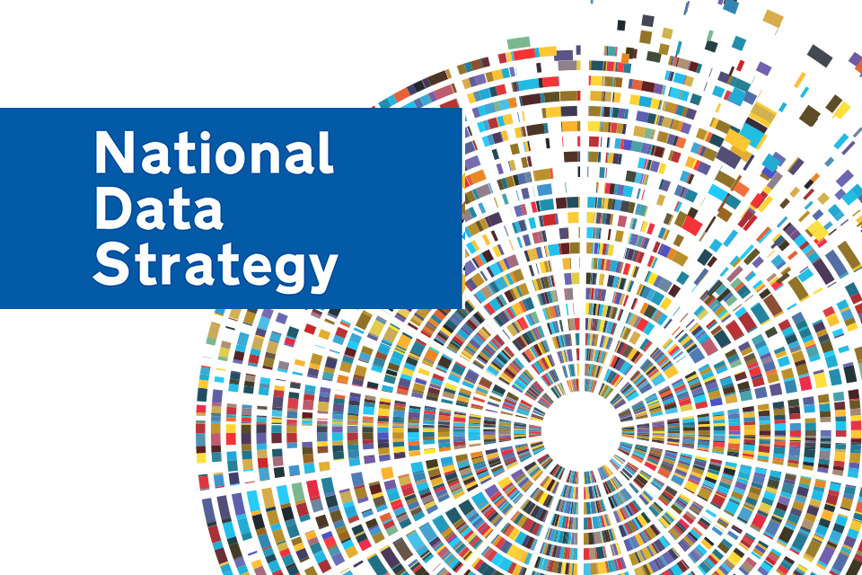
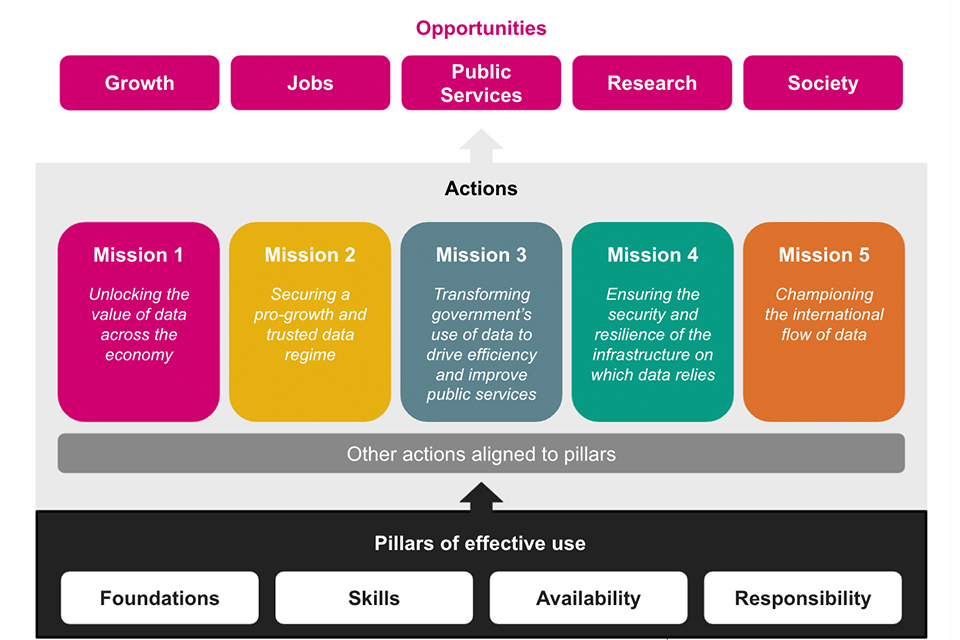
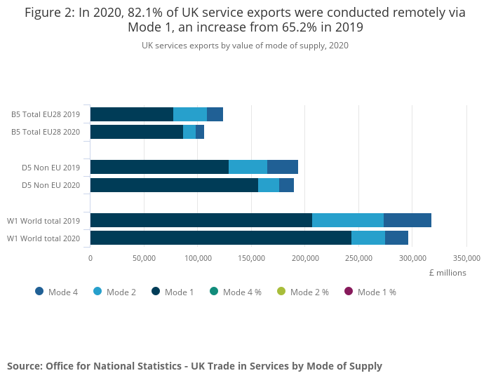
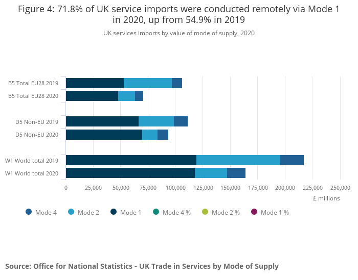
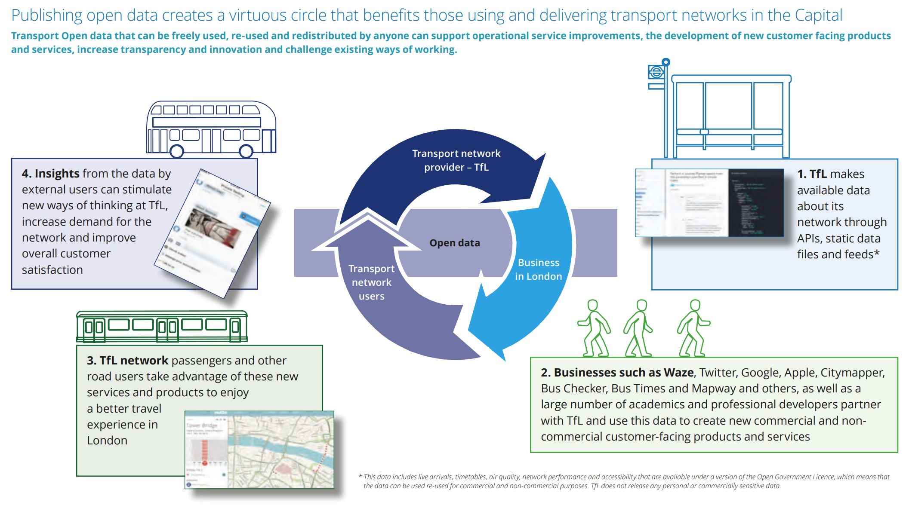
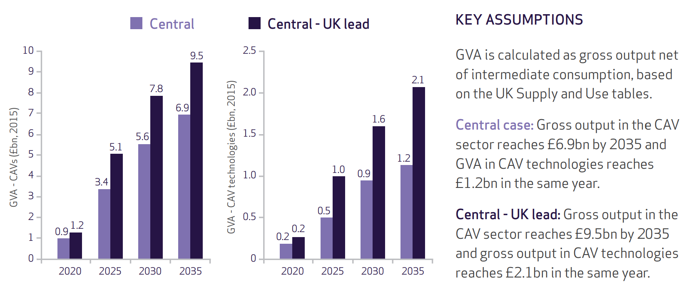
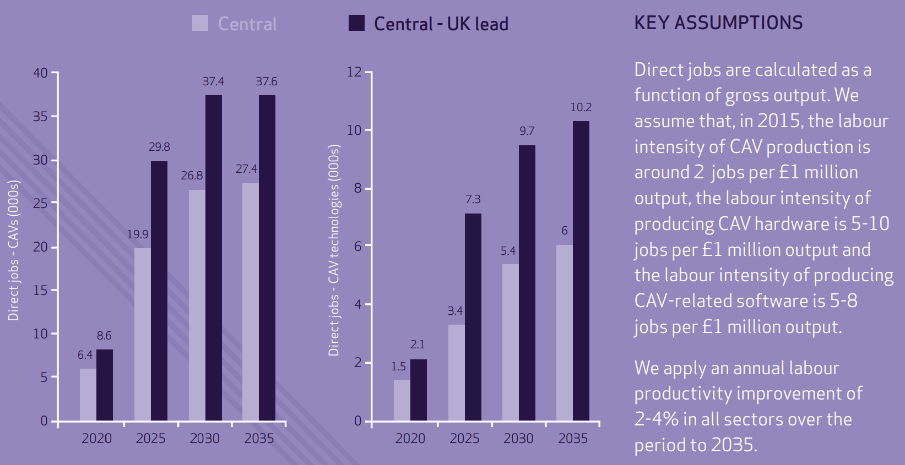

## {.center}

{.r-stretch fig-align="center"}

## Khung chiến lược dữ liệu quốc gia {.center}

{fig-align="center"}

## Các trụ cột chính của Chiến lược Dữ liệu Quốc gia Vương quốc Anh {.center background-color="#002147"}

## Nền tảng dữ liệu

- Dữ liệu chỉ phát huy hết tiềm năng khi nó có chất lượng cao, phù hợp với mục đích sử dụng và được ghi chép theo các định dạng tiêu chuẩn.

- Dữ liệu phải được lưu trữ trên các hệ thống hiện đại, bền vững, đảm bảo dễ dàng tìm kiếm, truy cập, kết hợp và tái sử dụng.

- Bằng cách nâng cao chất lượng dữ liệu, chúng ta có thể sử dụng nó hiệu quả hơn và đạt được những hiểu biết sâu sắc hơn cùng kết quả cải thiện.

## Kỹ năng dữ liệu

- Để tận dụng tối đa dữ liệu, cần có một đội ngũ nhân lực có kỹ năng dữ liệu mạnh mẽ.

- Điều này bao gồm việc cung cấp đào tạo và kiến thức phù hợp thông qua hệ thống giáo dục.

- Nó cũng có nghĩa là đảm bảo cá nhân có thể tiếp tục phát triển và cập nhật kỹ năng dữ liệu của mình suốt đời.

## Tính sẵn có của dữ liệu

- Dữ liệu có tác động lớn nhất khi nó dễ dàng truy cập, di chuyển và tái sử dụng.

- Để đạt được điều này, cần khuyến khích sự phối hợp và chia sẻ dữ liệu chất lượng cao giữa các tổ chức trong khu vực công, tư nhân và phi lợi nhuận.

- Nó cũng đòi hỏi phải đảm bảo các biện pháp bảo vệ mạnh mẽ và phù hợp cho việc lưu chuyển dữ liệu quốc tế an toàn.

## Dữ liệu có trách nhiệm

- Khi chúng ta mở rộng việc sử dụng dữ liệu, nó phải được quản lý một cách có trách nhiệm.

- Việc sử dụng dữ liệu luôn phải tuân thủ pháp luật, an toàn, công bằng, đạo đức, bền vững và có trách nhiệm.

- Chúng ta cũng phải đảm bảo rằng các biện pháp bảo vệ này tiếp tục thúc đẩy sự đổi mới và nghiên cứu.

## Năm lĩnh vực ưu tiên hành động {.center background-color="#002147"}

## Phát huy giá trị của dữ liệu trên toàn nền kinh tế {.smaller}

- Tiềm năng đầy đủ của dữ liệu chưa được khai thác vì thông tin quan trọng chưa đến được với những người và khu vực cần nó.

- Trọng tâm ban đầu là tạo ra điều kiện thuận lợi để dữ liệu có thể sử dụng được, dễ tiếp cận và phổ biến rộng rãi trên toàn bộ nền kinh tế.

- Đảm bảo bảo vệ mạnh mẽ quyền dữ liệu của cá nhân và quyền sở hữu trí tuệ của các doanh nghiệp tư nhân.

- Áp dụng phương pháp tiếp cận thận trọng, dựa trên bằng chứng để thiết kế khung chính sách rõ ràng, xác định các can thiệp của chính phủ cần thiết để đạt được các mục tiêu này.

## Xây dựng một chế độ dữ liệu thúc đẩy tăng trưởng và đáng tin cậy {.smaller}

- Cách mạng dữ liệu mang lại lợi ích cho các doanh nghiệp mọi quy mô.

- Mục tiêu là tạo ra một chế độ dữ liệu dễ dàng cho các công ty sử dụng và hỗ trợ việc sử dụng dữ liệu một cách có trách nhiệm và an toàn.

- Giảm thiểu sự không chắc chắn hoặc rủi ro pháp lý không cần thiết để hỗ trợ các nhà đổi mới thúc đẩy tăng trưởng kinh tế.

- Công chúng cảm thấy tự tin và có quyền kiểm soát cách dữ liệu của họ được sử dụng, bao gồm cả dữ liệu cá nhân.

- Khuyến khích cạnh tranh và đổi mới đồng thời duy trì các tiêu chuẩn bảo vệ dữ liệu cao.

- Xây dựng niềm tin mà không đặt ra các rào cản không cần thiết đối với việc sử dụng dữ liệu.

## Chuyển đổi cách chính phủ sử dụng dữ liệu để nâng cao hiệu quả và cải thiện dịch vụ công {.smaller}

- Tiềm năng chưa được khai thác đáng kể trong cách chính phủ và dịch vụ công sử dụng và chia sẻ dữ liệu để hỗ trợ người dân.

- Cải thiện cách quản lý, sử dụng và chia sẻ thông tin trong toàn bộ chính phủ.

- Yêu cầu một cách tiếp cận phối hợp, toàn diện của chính phủ, thống nhất xung quanh các thực hành tốt nhất và tiêu chuẩn chung để khai thác giá trị và thông tin từ dữ liệu.

- Xây dựng hạ tầng dữ liệu an toàn, kết nối và tương thích với các biện pháp bảo vệ phù hợp.

- Phát triển kỹ năng dữ liệu và lãnh đạo mạnh mẽ trong khu vực công là yếu tố thiết yếu để khai thác hết tiềm năng của dữ liệu.

## Đảm bảo an ninh và khả năng phục hồi của hạ tầng mà dữ liệu phụ thuộc vào {.smaller}

- Các hệ thống hỗ trợ dữ liệu phải đảm bảo an toàn và bảo mật.

- Hạ tầng sử dụng dữ liệu là tài sản quốc gia quan trọng và cần được bảo vệ khỏi các mối đe dọa an ninh và rủi ro khác, bao gồm cả sự gián đoạn dịch vụ.

- Mặc dù việc quản lý các rủi ro này phần nào là trách nhiệm của doanh nghiệp, chính phủ phải đảm bảo rằng dữ liệu và hạ tầng hỗ trợ của nó có khả năng chống chịu với cả các mối đe dọa hiện tại và mới nổi.

- Tăng cường khả năng chống chịu này là điều cần thiết để bảo vệ và duy trì nền kinh tế đang phát triển.

## Khuyến khích dòng chảy dữ liệu quốc tế {.smaller}

- Lưu chuyển dữ liệu xuyên biên giới thúc đẩy hoạt động kinh doanh toàn cầu, chuỗi cung ứng và thương mại, hỗ trợ tăng trưởng kinh tế trên toàn thế giới.

- Việc di chuyển dữ liệu cũng mang lại lợi ích xã hội, chẳng hạn như cho phép thanh toán lương và giúp mọi người duy trì kết nối qua khoảng cách xa.

- Chia sẻ dữ liệu y tế có thể thúc đẩy nghiên cứu khoa học quan trọng và hỗ trợ các phản ứng quốc tế phối hợp đối với các tình huống khẩn cấp y tế toàn cầu.

- Khuyến khích các thực hành dữ liệu trong nước mạnh mẽ và hợp tác với các đối tác quốc tế để tránh các rào cản không cần thiết do biên giới quốc gia hoặc các quy định phân mảnh gây ra.

## Cơ hội dữ liệu {.center background-color="#002147"}

## Tăng cường năng suất và thương mại - dịch vụ được cung cấp qua kỹ thuật số {.center}

:::: {.columns}

::: {.column width="50%"}

Xuất khẩu

{fig-align="center"}

:::

::: {.column width="50%"}

Nhập khẩu

{fig-align="center"}

:::

::::

## Tăng cường năng suất và thương mại - Dữ liệu mở của Transport for London {.center}

{.r-stretch fig-align="center"}

## Tăng cường năng suất và thương mại - Dữ liệu đầu vào của Chính phủ Vương quốc Anh {.smaller}

- Chính phủ đã cam kết tăng đầu tư vào nghiên cứu và phát triển, phần lớn trong số đó là các dự án đòi hỏi nhiều dữ liệu, lên 2,4% GDP vào năm 2027.

- Các cơ quan mới đã được thành lập, bao gồm [Centre for Data Ethics and Innovation (CDEI)](https://www.gov.uk/government/organisations/centre-for-data-ethics-and-innovation) và [Alan Turing Institute](https://www.turing.ac.uk/).

- Chính phủ đã giới thiệu các khóa học mới về khoa học dữ liệu và trí tuệ nhân tạo.

- Chính phủ đã thực hiện các nghiên cứu tiên phong về*"quỹ dữ liệu",*một khung khổ mới cho việc chia sẻ dữ liệu.

## Hỗ trợ các doanh nghiệp mới và tạo việc làm - kinh tế số và ngành giao thông vận tải {.center}

:::: {.columns}

::: {.column width="50%"}

Giá trị gia tăng (GVA)

{fig-align="center"}

:::

::: {.column width="50%"}

Việc làm

{fig-align="center"}

:::

::::

## Tăng cường tốc độ, hiệu quả và quy mô của nghiên cứu khoa học - NHS và các thử nghiệm lâm sàng {.smaller}

- Thử nghiệm lâm sàng dựa trên dữ liệu để đối phó với coronavirus - Thử nghiệm [RECOVERY](https://www.recoverytrial.net/).

- Sử dụng hồ sơ y tế điện tử của NHS để xác định và cho phép cá nhân tham gia từ khắp Vương quốc Anh.

- Thông thường, các thử nghiệm lâm sàng mất nhiều tháng để thiết lập, nhưng thử nghiệm RECOVERY đã được triển khai chỉ trong vài ngày.

- 12\.000 bệnh nhân từ 176 tổ chức bệnh viện NHS đã tham gia thử nghiệm, với dữ liệu được theo dõi và phân tích.

- Trong vòng 100 ngày, thử nghiệm đã xác định được phương pháp điều trị coronavirus đầu tiên trên thế giới được chứng minh là cứu sống - *Dexamethasone*.

- RECOVERY được hỗ trợ bởi [NHS DigiTrials](https://digital.nhs.uk/services/nhs-digitrials) và [Health Data Research UK](https://www.hdruk.ac.uk/).

## Nâng cao hiệu quả triển khai chính sách và dịch vụ công - Data First {.smaller}

- [**Data First**](https://www.gov.uk/guidance/ministry-of-justice-data-first) là chương trình liên kết dữ liệu quy mô lớn do [Ministry of Justic (MoJ)](https://www.gov.uk/government/organisations/ministry-of-justice) triển khaivà được tài trợ bởi [UK Research and Innovation](https://www.ukri.org/).

- Chương trình cung cấp quyền truy cập an toàn vào các bộ dữ liệu hành chính đã được ẩn danh và liên kết từ MoJ và các cơ quan của nó, đồng thời có khả năng kết nối các dữ liệu này với dữ liệu từ các bộ khác (ví dụ: Bộ Giáo dục).

- Chương trình hỗ trợ các nhà nghiên cứu phân tích cách cá nhân tương tác với hệ thống tư pháp theo thời gian và xác định các yếu tố liên quan đến việc sử dụng tòa án thường xuyên.

- Chương trình cho phép hiểu sâu hơn về cách nền tảng xã hội, kinh tế và giáo dục của cá nhân ảnh hưởng đến trải nghiệm và kết quả của họ trong hệ thống tư pháp.

- Những hiểu biết này sẽ hỗ trợ việc xây dựng chính sách hiệu quả hơn dựa trên bằng chứng, cải thiện dịch vụ và giảm chi phí.

- Dữ liệu được truy cập thông qua [ONS Secure Research Server](https://www.ons.gov.uk/aboutus/whatwedo/statistics/requestingstatistics/secureresearchservice), đáp ứng các tiêu chuẩn cao về an ninh và bảo vệ dữ liệu theo [Five Safes Framework](https://www.gov.uk/data-ethics-guidance/the-five-safes-framework).

## Xây dựng một xã hội công bằng hơn cho tất cả - Công cụ thống kê về bạo lực gia đình của ONS {.smaller}

- Báo cáo về bạo lực gia đình của ONS kết hợp dữ liệu từ nhiều nguồn - bao gồm các cuộc điều tra, hồ sơ cảnh sát, cơ quan chính phủ và dịch vụ hỗ trợ - để cung cấp một bức tranh toàn diện hơn về bạo lực gia đình ở cấp quốc gia và địa phương.

- Việc tích hợp các nguồn dữ liệu này giúp nâng cao hiểu biết về trải nghiệm của nạn nhân và đánh giá cách hệ thống tư pháp hình sự phản ứng với kẻ gây ra bạo lực.

- Công cụ dữ liệu tương tác kèm theo cho phép người dùng khám phá và so sánh thống kê theo khu vực lực lượng cảnh sát, giúp xác định các câu hỏi và ưu tiên cho các cơ quan xử lý bạo lực gia đình.

- Các thống kê này cũng góp phần theo dõi tiến trình của Vương quốc Anh hướng tới 17 Mục tiêu Phát triển Bền vững của Liên Hợp Quốc trong khuôn khổ Chương trình Nghị sự 2030.

