## {.center}

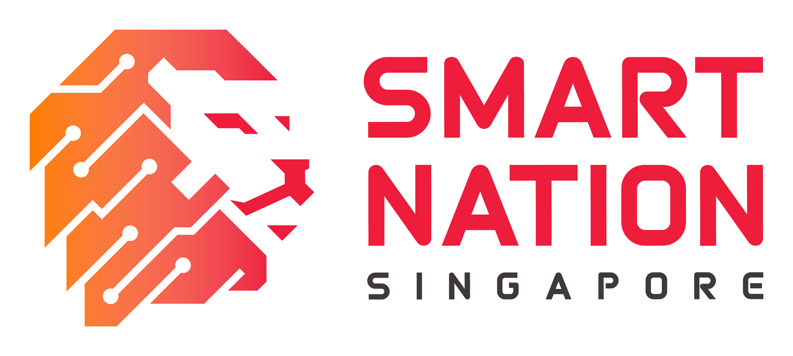{.r-stretch fig-align="center"}

## Hành trình Quốc gia Thông minh {.center}

::: {layout-ncol="6" layout-valign="bottom"}

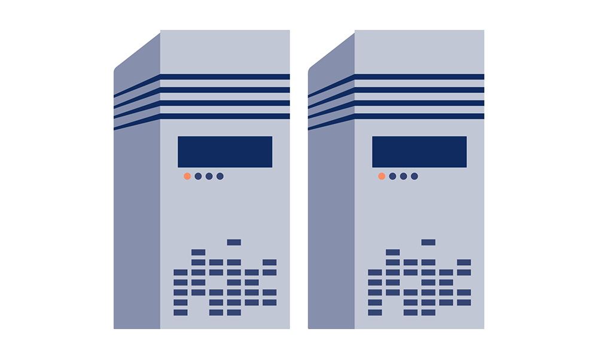

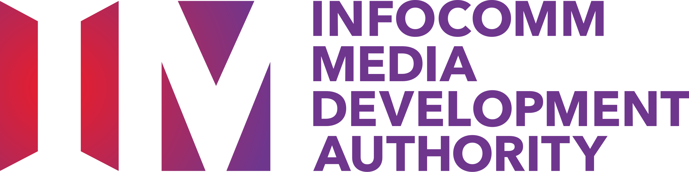

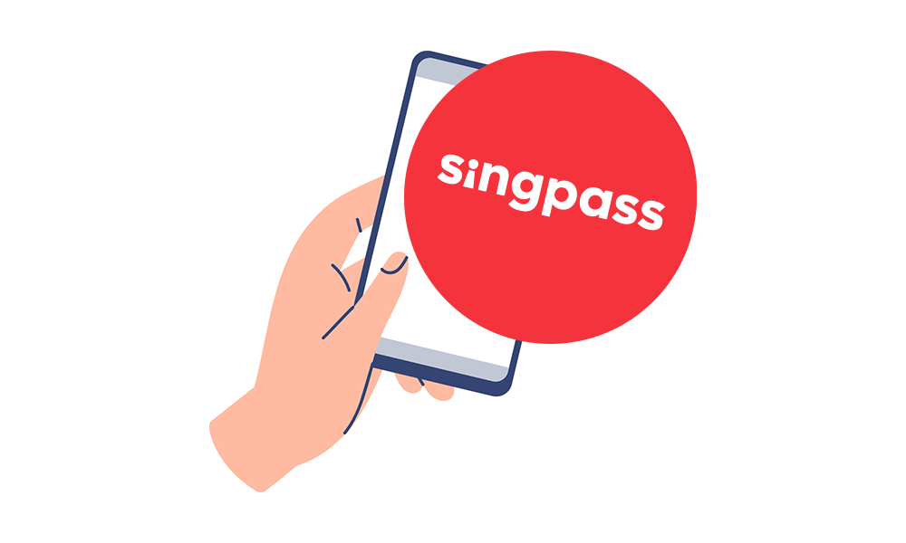

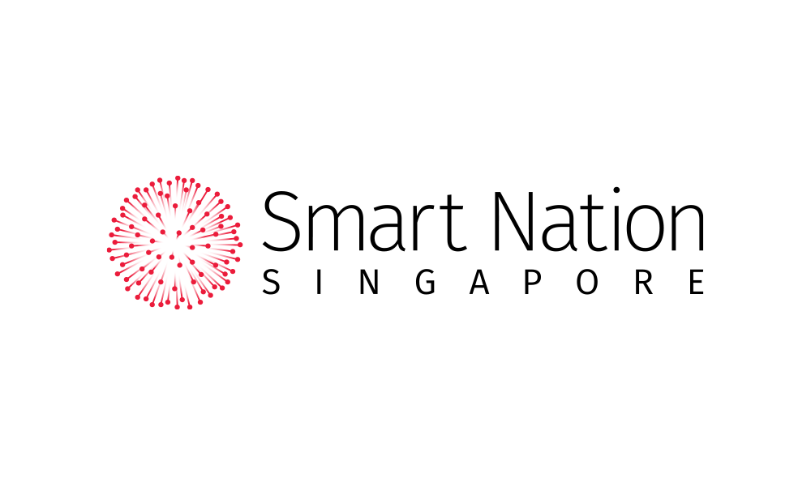

:::

::: {layout-ncol="6"}

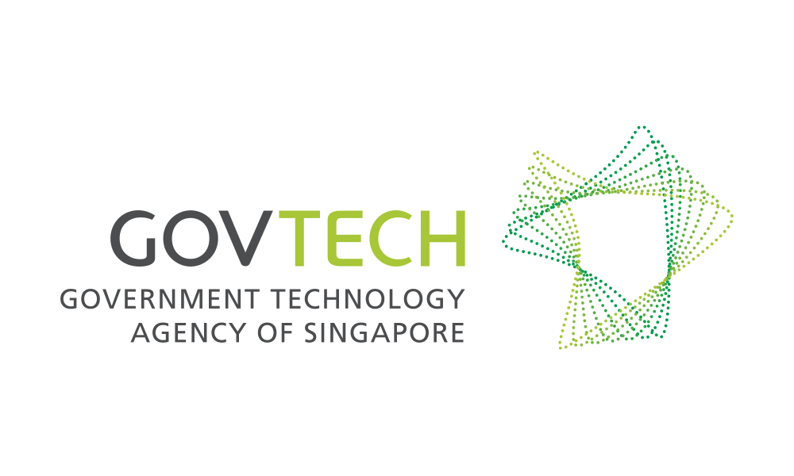

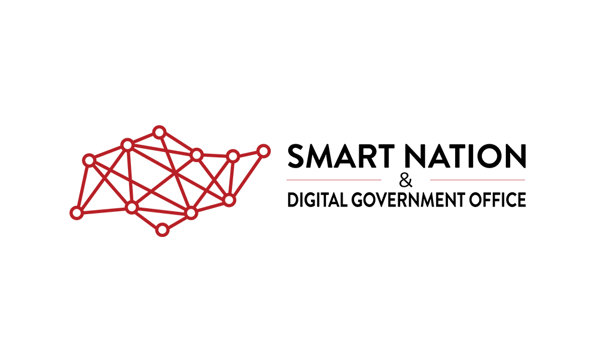

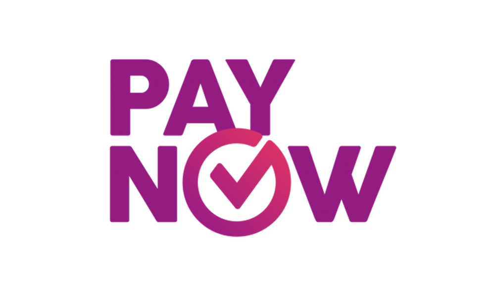

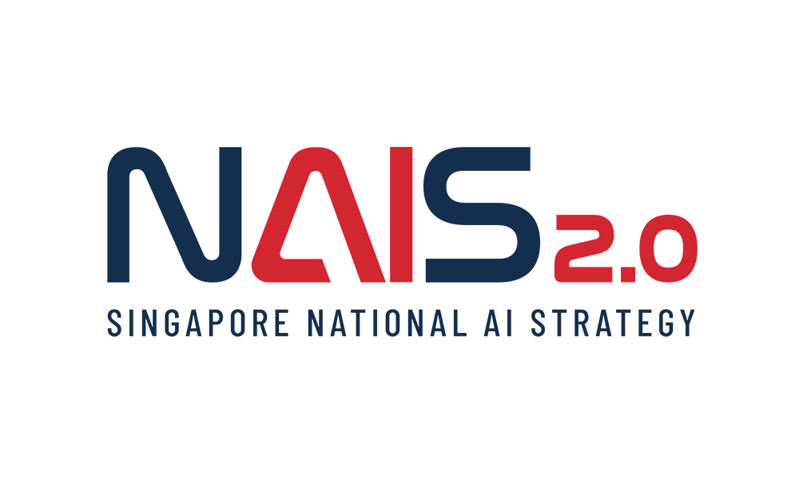

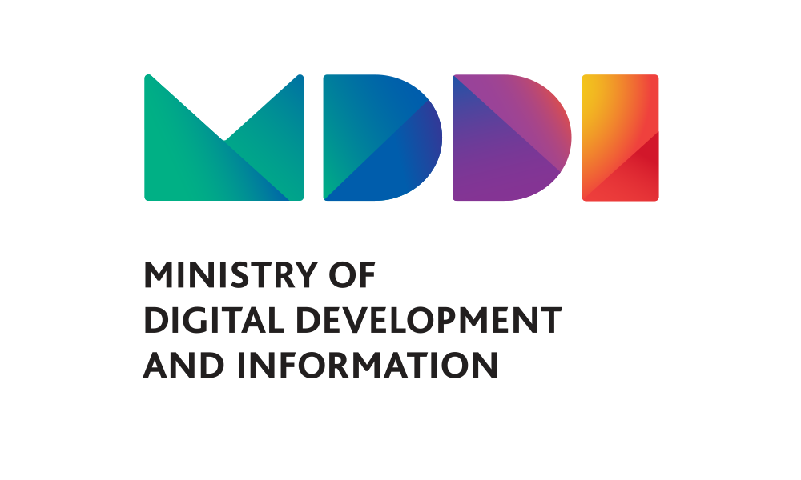

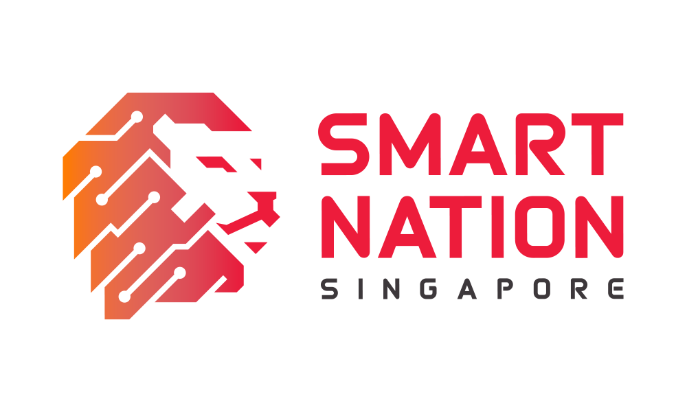

:::

## Tầm nhìn {.smaller}

- **Chương trình Quốc gia Thông minh** của Singapore, do Bộ Phát triển Kỹ thuật số và Thông tin (MDDI) dẫn dắt, hướng đến mục tiêu xây dựng một tương lai kỹ thuật số thịnh vượng cho tất cả mọi người.

- Ra mắt vào **năm 2014**, Smart Nation 1.0 hướng đến việc cải thiện cuộc sống thông qua việc sử dụng công nghệ một cách liền mạch và có ý nghĩa.

- Kể từ khi ra mắt, Singapore đã tích hợp công nghệ số sâu rộng vào cuộc sống hàng ngày, tạo ra những cơ hội mới đồng thời cũng cần quản lý các rủi ro đối với sức khỏe và sự đoàn kết xã hội.

- Năm **2024**, Singapore đã giới thiệu **Smart Nation 2.0**, một tầm nhìn mới tập trung vào việc sử dụng công nghệ hiệu quả hơn để chuyển đổi tương lai của quốc gia.

- Giai đoạn mới này chuyển từ việc chủ yếu xây dựng năng lực số sang áp dụng chúng một cách chiến lược để định hình sự phát triển lâu dài của Singapore.

## Mục tiêu {.center background-color="#002147"}

## Niềm tin

::: {layout-ncol="3"}

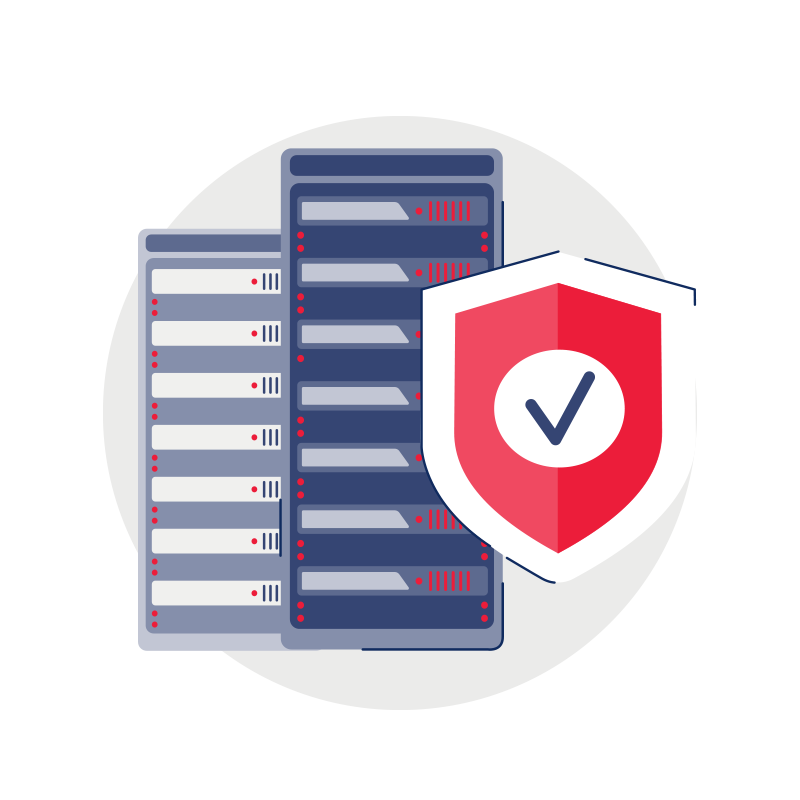

:::

## Phát triển

::: {layout-ncol="3"}

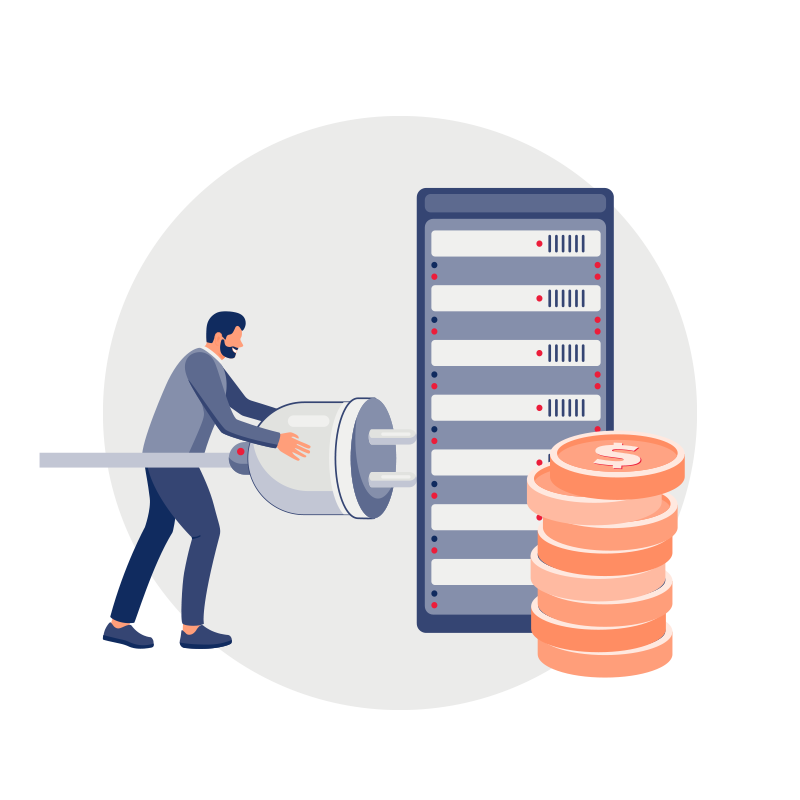

:::

## Cộng đồng

::: {layout-ncol="3"}

:::

## Thành tựu của Thành phố Thông minh {.smaller}

- **99%** các giao dịch giữa công dân và chính phủ có thể được thực hiện trực tuyến.

- **Mức độ hài lòng của công dân và doanh nghiệp** đối với Dịch vụ số của Chính phủ đạt**83%**vào năm 2023.

- **99%** hộ gia đình cư dân được **kết nối internet**, tính đến năm 2022.

- **95%** doanh nghiệp vừa và nhỏ (SMEs) đã áp dụng ít nhất một công nghệ số từ chín lĩnh vực: an ninh mạng, điện toán đám mây, thanh toán điện tử, thương mại điện tử, phân tích dữ liệu, trí tuệ nhân tạo, Internet of Things, blockchain và truyền thông tương tác.

## Chiến lược Trí tuệ Nhân tạo Quốc gia {.center}

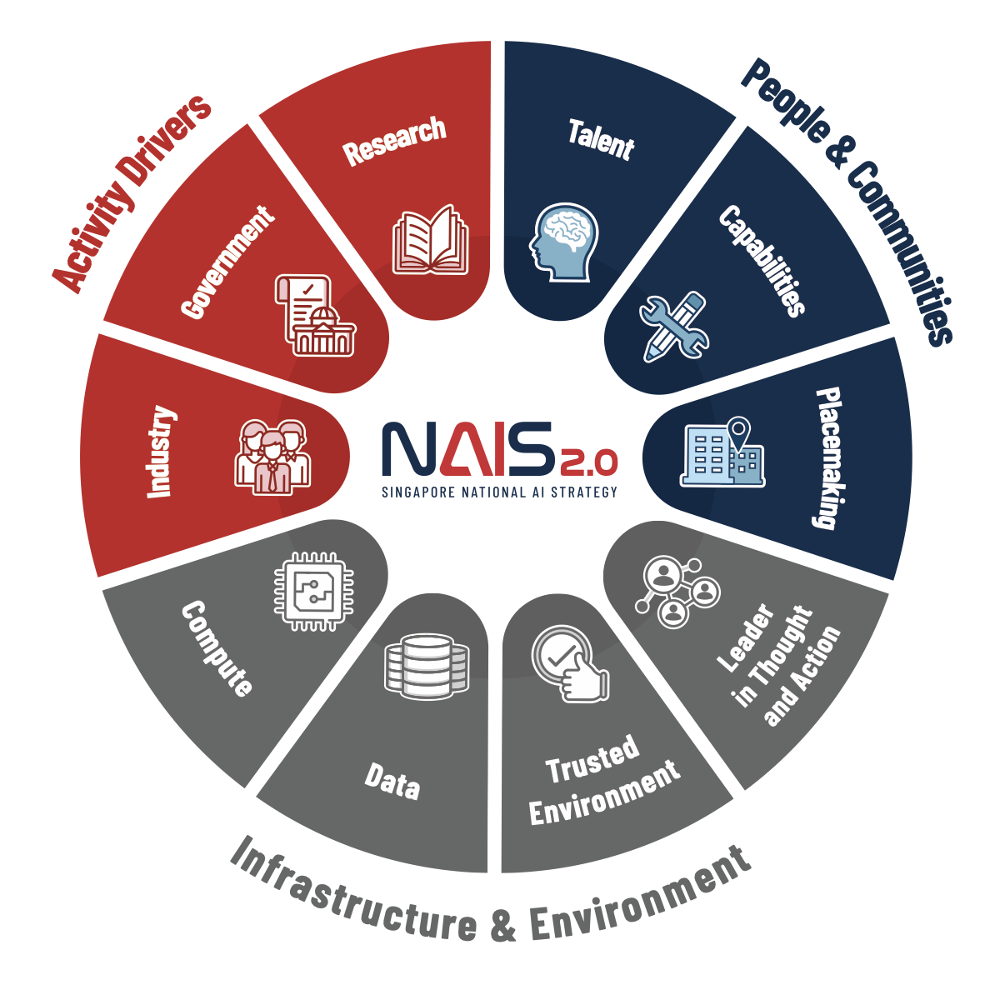{.r-stretch fig-align="center"}

## Sản phẩm Chính phủ Mở {.center background-color="#002147"}

## Phương pháp

::: {layout-ncol="3"}

:::

## Sản phẩm {.smaller}

- Hơn 40 sản phẩm đang trong quá trình phát triển

- Sử dụngcơ chế **báo cáo tiến độ** để cung cấp cái nhìn tổng quan minh bạch về công việc đang được thực hiện trên từng sản phẩm

:::: {.columns}

::: {.column width=33%}

#### Giải quyết các vấn đề thực tế

Chia sẻ lý do và cách sản phẩm giải quyết vấn đề thông qua các bản cập nhật định kỳ.

:::

::: {.column width=33%}

#### Sử dụng tài nguyên một cách có trách nhiệm

Chi phí sản phẩm được công khai một cách minh bạch nhất có thể để đảm bảo trách nhiệm giải trình với người nộp thuế và công dân.

:::

::: {.column width=33%}

#### Theo dõi tác động một cách rõ ràng

Chia sẻ kết quả sản phẩm để đảm bảo mang lại giá trị rõ ràng cho công chúng.

:::

::::

## {.center}

{fig-align="center"}

- [**ScamShield**](https://www.scamshield.gov.sg/) hỗ trợ người dùng phát hiện, kiểm tra và báo cáo các tin nhắn, cuộc gọi và liên kết đáng ngờ.

- Các vụ lừa đảo được báo cáo sẽ được cơ quan chức năng xác minh, giúp họ theo dõi và phản ứng với các biến thể lừa đảo mới.

## {.center .smaller}

{fig-align="center" width="800px"}

- Các chiến dịch sử dụng phiếu giấy gặp khó khăn trong việc triển khai và gây bất tiện cho người dân khi nhận và sử dụng.

- Các nhà bán lẻ gặp phải tình trạng chậm trễ kéo dài trong việc nhận thanh toán.

- Các giải pháp kỹ thuật số hiện có sẵn nhưng phân tán trên nhiều ứng dụng phức tạp.

- [**RedeemSG**](https://redeem.gov.sg/) cung cấp một nền tảng thống nhất cho các cơ quan chính phủ và tổ chức phi lợi nhuận để tạo, phân phối và theo dõi phiếu giảm giá trên toàn quốc.

- Công dân có thể đổi phiếu giảm giá và các doanh nghiệp có thể chấp nhận chúng thông qua cùng một hệ thống.

## {.center .smaller}

{fig-align="center"}

- Hệ thống theo dõi dựa trên giấy tờ khiến các tổ chức gặp khó khăn trong việc theo dõi việc phân phối hoặc điều chỉnh kế hoạch theo thời gian thực.

- Điều này dẫn đến thời gian chờ đợi kéo dài, hồ sơ không chính xác và khả năng tiếp cận thêm người hưởng lợi bị hạn chế.

- [**DistributeSG**](https://distribute.gov.sg/) cho phép các cơ quan chính phủ và tổ chức phi lợi nhuận triển khai và theo dõi các chiến dịch phân phối với khả năng theo dõi theo thời gian thực.

- Nó bao gồm một cổng thông tin quản trị cho các nhà tổ chức thiết lập chiến dịch và một ứng dụng di động để theo dõi trực tiếp các mặt hàng đã phân phối.

## Các sáng kiến {.center background-color="#002147"}

## {.center .smaller}

{fig-align="center"}

- **Build for Good** là một sáng kiến tham gia của công dân do Open Government Products khởi xướng, khuyến khích công dân góp phần cải thiện Singapore.

- Công dân có thể tham gia thông qua một **cuộc thi lập trình**, một **chương trình tăng tốc cho các đội chiến thắng** hoặc bằng cách gia nhập **cộng đồng**.

- Sáng kiến này nhằm tạo ra một không gian hỗ trợ nơi cá nhân cảm thấy được trao quyền để đóng góp tích cực, thử nghiệm và xây dựng các giải pháp làm cho thế giới tốt đẹp hơn.

## {.center .smaller}

{fig-align="center"}

- **Hack for Public Good (HFPG)** thay thế phương pháp phát triển sản phẩm từ trên xuống bằng một cách tiếp cận do cộng đồng dẫn dắt.

- Thay vì ban lãnh đạo xác định hướng đi, các đội ngũ công nghệ sẽ tương tác trực tiếp với cộng đồng để xác định các vấn đề vì lợi ích công cộng tại Singapore.

- Các đội ngũ này sau đó thiết kế và xây dựng giải pháp dựa trên những gì họ phát hiện.

## Singapore government tech stack {.center background-color="#002147"}

## Tổng quan {.center}

- **Singapore Government Tech Stack (SGTS)** hiện đại hóa các thực hành phát triển trên toàn bộ chính phủ.

- Mục tiêu là hỗ trợ việc tạo ra các hệ thống an toàn, linh hoạt, đáp ứng được nhu cầu ngày càng thay đổi của công dân và doanh nghiệp.

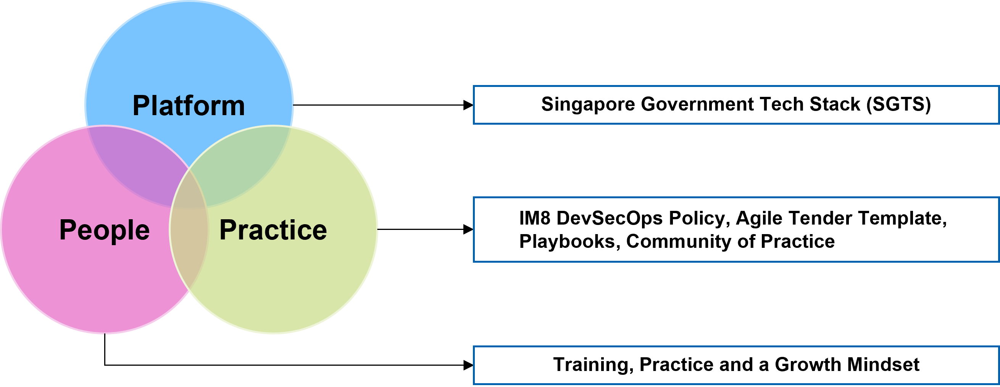{fig-align="center" width="1000px"}

## Kiến trúc {.center}

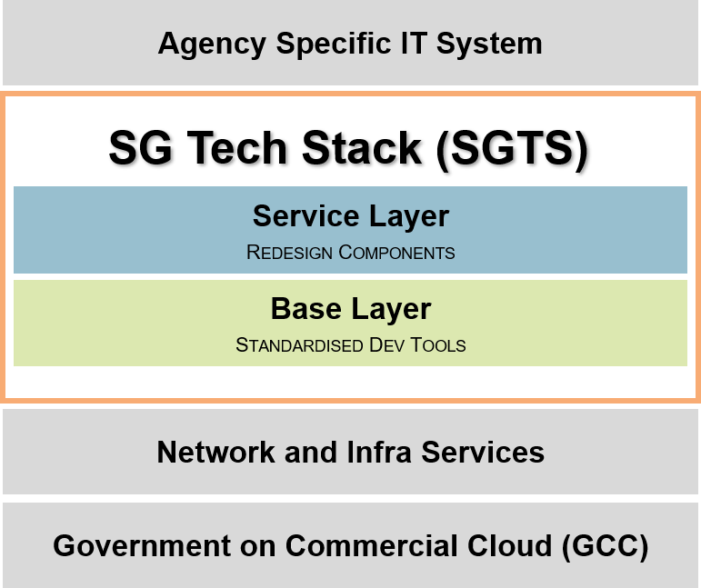{fig-align="center"}

## Kiến trúc - lớp nền tảng

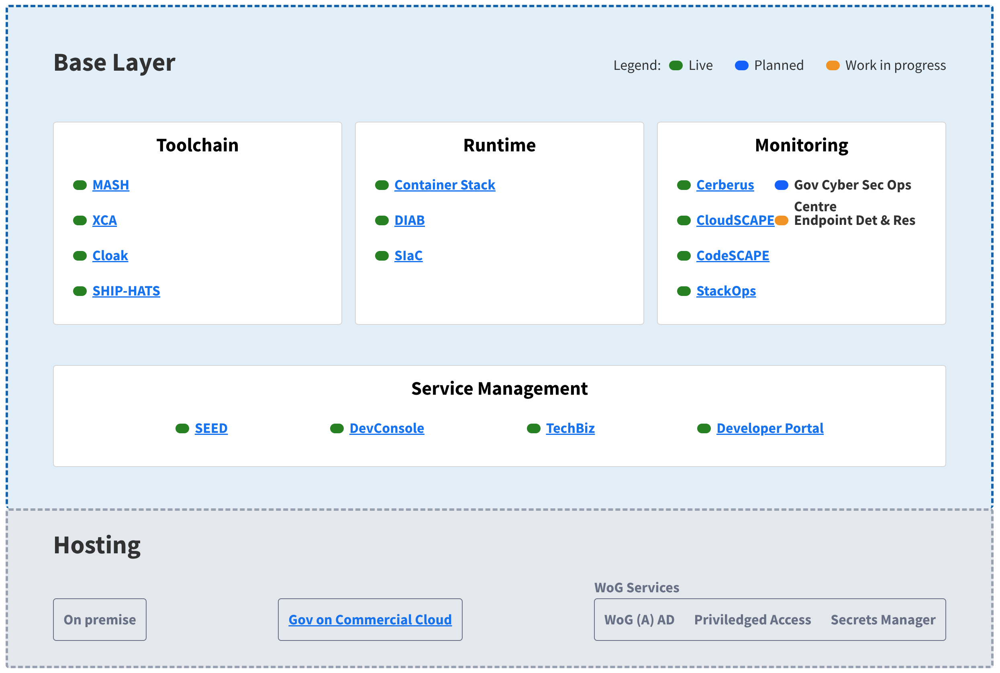{fig-align="center"}

## Kiến trúc - Lớp dịch vụ {.center}

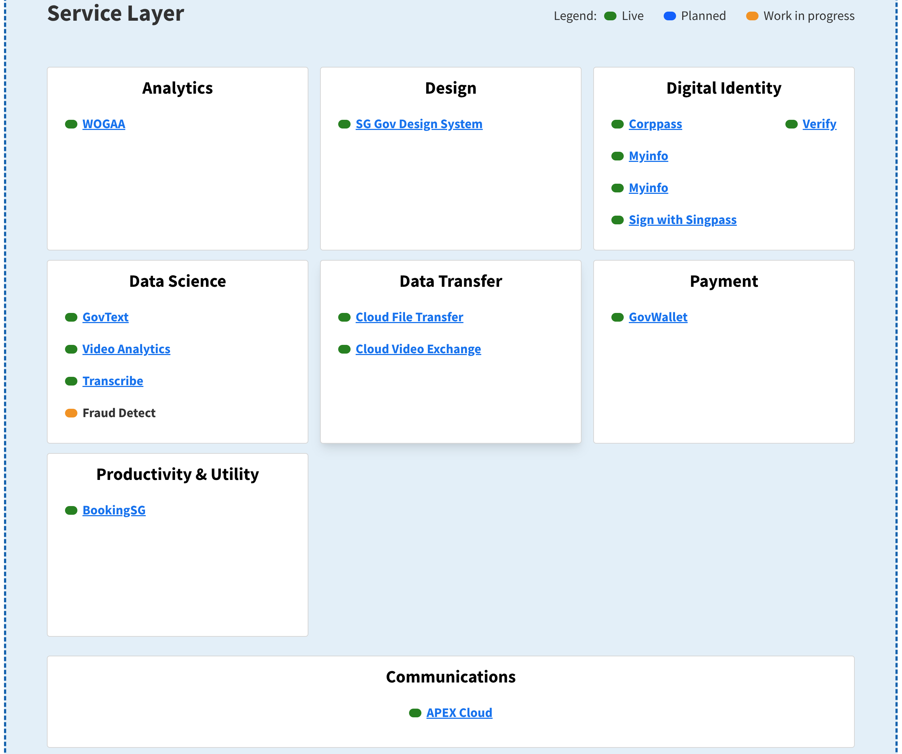{fig-align="center"}

## Câu chuyện thành công {.center background-color="#002147"}

Tối ưu hóa quy trình nộp báo cáo lương tại Singapore: Giải pháp của APEX cho báo cáo chính phủ hiệu quả

## Vấn đề {.center .smaller}

:::: {.columns}

::: {.column width="50%"}

- Các công ty đăng ký tại Singapore phải thường xuyên nộp dữ liệu về lương nhân viên, lực lượng lao động và đóng góp CPF cho các cơ quan chính phủ (IRAS, MOM, CPFB).

- Tất cả dữ liệu yêu cầu đã tồn tại trong hệ thống lương hoặc nhân sự của các công ty.

- Thách thức là tích hợp các quy trình nộp báo cáo chính phủ với các hệ thống này để tối ưu hóa quy trình, giảm thiểu công việc thủ công và tiết kiệm thời gian cũng như nguồn lực cho nhà tuyển dụng.

:::

::: {.column width="50%"}

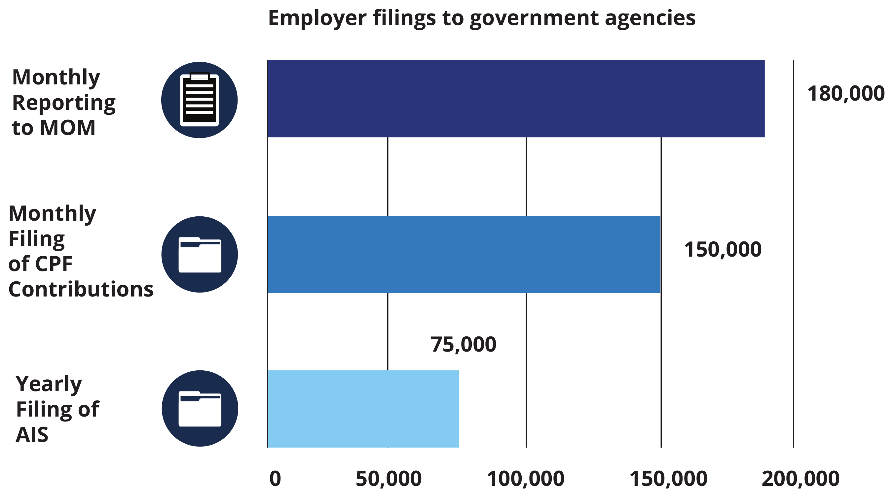{fig-align="center"}

:::

::::

## Giải pháp {.center .smaller}

- **APEX** tích hợp các giao diện lập trình ứng dụng (API) từ nhiều cơ quan chính phủ trên một nền tảng an toàn duy nhất.

- Nó cho phép các nhà phát triển, bao gồm cả nhà cung cấp phần mềm nhân sự và tiền lương, tích hợp dễ dàng với các dịch vụ này.

- APEX loại bỏ nhu cầu nộp hồ sơ thủ công, giảm bớt gánh nặng hành chính và hỗ trợ tuân thủ tốt hơn các quy định liên quan đến lương bổng.

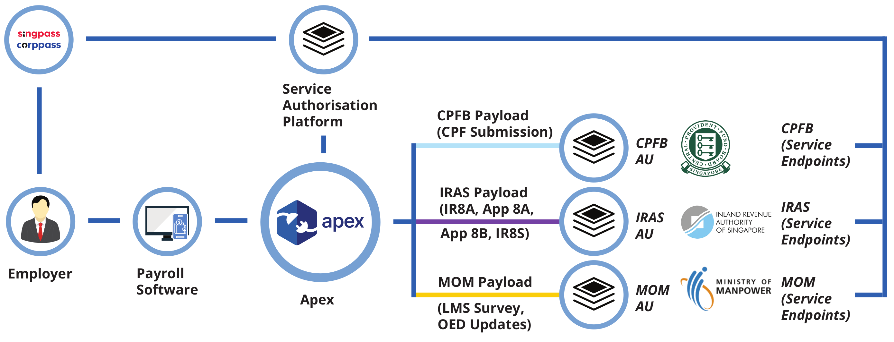{fig-align="center"}

