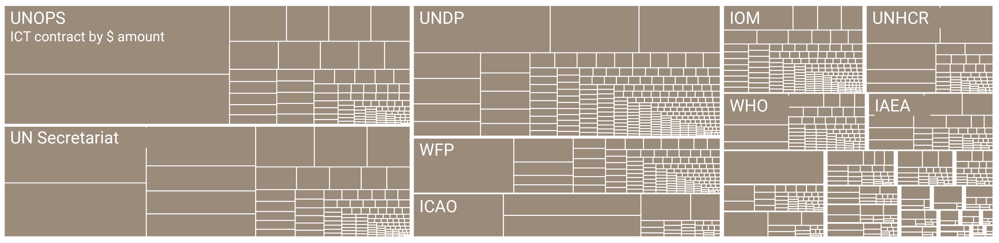
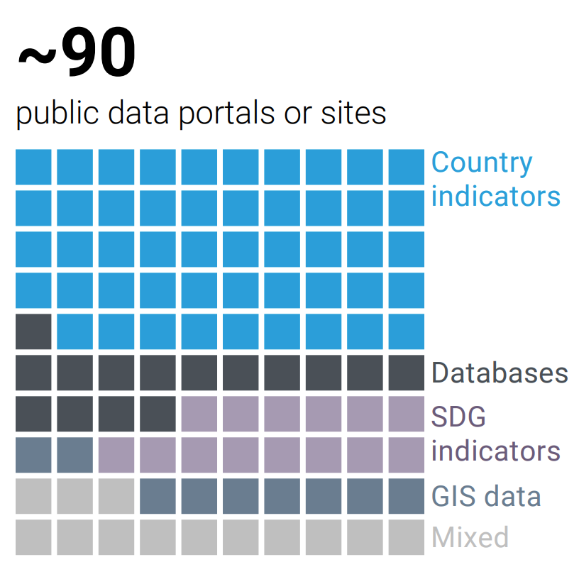

## {.center}

{fig-align="center"}

## Costly and fragmented services, lagging in a digital age {.center background-color="#002147"}

## The problem

* The UN system’s technology infrastructure is fragmented, expensive, and not strong enough for today’s digital demands.

* Digital advancements, including artificial intelligence, are reshaping the world, but the UN’s tech capabilities have not kept pace.

* Over **$2 billion** is spent each year on software, cloud services, connectivity, and related support.

## The problem (continued)

* Much of this spending happens in isolation, without scale, leading to higher costs, duplication, and weak interoperability.

* These inefficiencies slow the UN’s ability to modernise and build future-ready capabilities.

* To remain credible and effective, the UN system must accelerate its digital adaptation.

## Costly and fragmented technology {.center}

{.r-stretch fig-align="center"}

## The solution

* The UN aims to harness technology responsibly to transform all aspects of its work.

* Shared ICT services and the UN 2.0 Agenda will guide this transformation.

* A new **Technology Accelerator Platform** will act as the system’s engine for change.

* It will modernise internal UN operations.

* It will also enhance the UN’s ability to support Member States in adopting digital and AI solutions effectively and responsibly.

## Fragmented data, missed opportunities {.center background-color="#002147"}

## The problem

* The UN system serves as a major custodian of global public data, statistics, and insights on topics ranging from population trends to climate risks.

* Despite this, its data platforms remain fragmented and duplicative, even as demand for faster and clearer information grows.

* Individual UN entities have built separate systems, resulting in parallel capacities that rarely connect.

## The problem (continued)

* Without interoperability, data cannot be shared effectively across entities, leading to blind spots, wasted effort, and missed opportunities to address interconnected global challenges.

* Data becomes far more useful when it is connected, but the capabilities needed to achieve this are limited, under-incentivised, and often hindered by entities’ reluctance to collaborate.

## Multiple public portals {.center}

{.r-stretch fig-align="center"}

## The solution

* New data initiatives will be developed across all UN pillars integrated into a **UN System Data Commons** built on shared data infrastructure.

* The shared backbone will be designed for full interoperability and able to generate insights at local, regional, and global levels.

* Entities will retain only the data that must remain separate, while all shareable data will be openly shared.

## The solution (continued)

* To make this transformation sustainable, interoperability will be supported by collective financing and clear governance incentives.

* This approach will help connect resources and systems more effectively, increase impact, and reduce overall costs.

