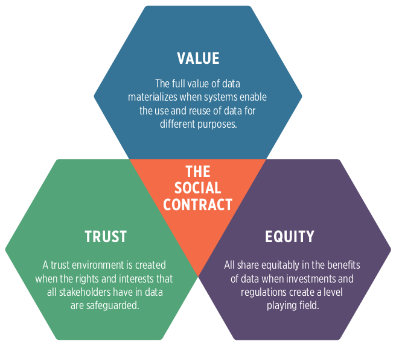
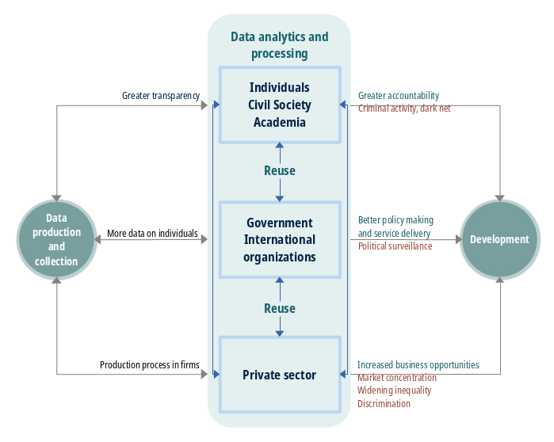
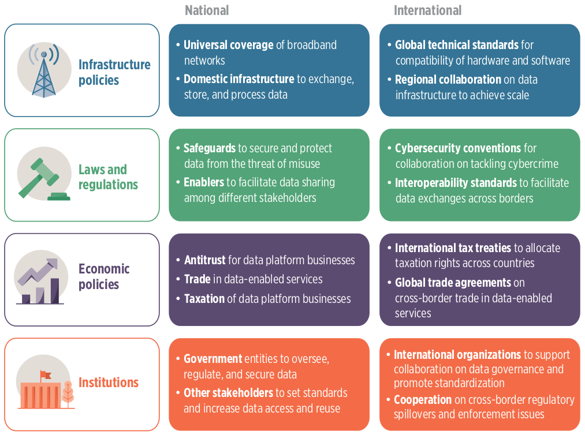
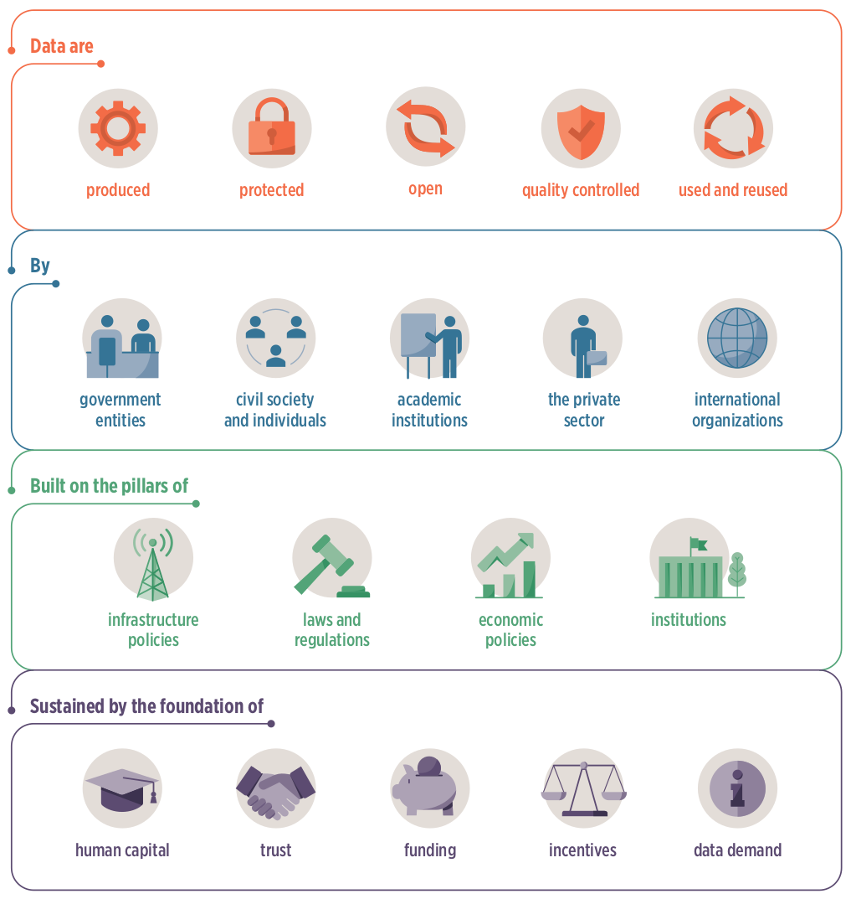
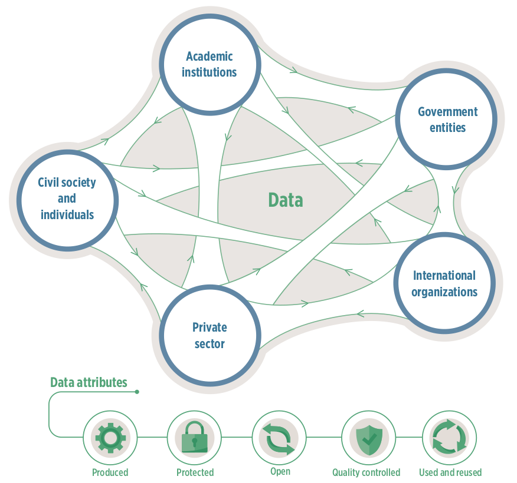
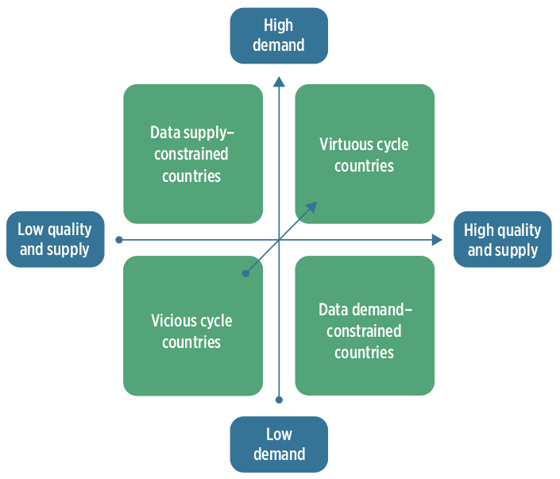
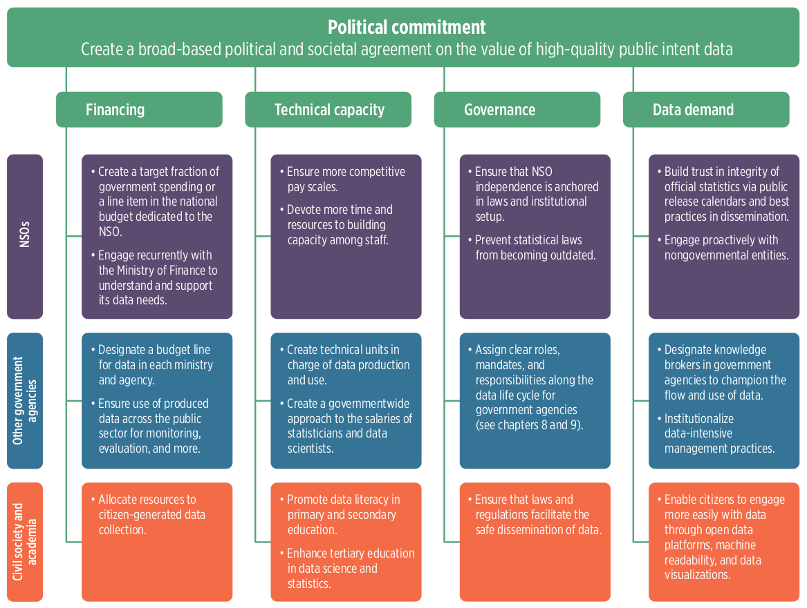

## Social contract for data {.center}

{fig-align="center"}

## Theory of change: data for development {.center}

{fig-align="center" height="500px"}

## Data governance layers {.center}

{fig-align="center"}

## Integrated national data system {.center}

{fig-align="center"}

## Data flow {.center}

{fig-align="center"}

## Data supply and demand {.center}

{fig-align="center"}

## Data policies {.center}

{fig-align="center"}
