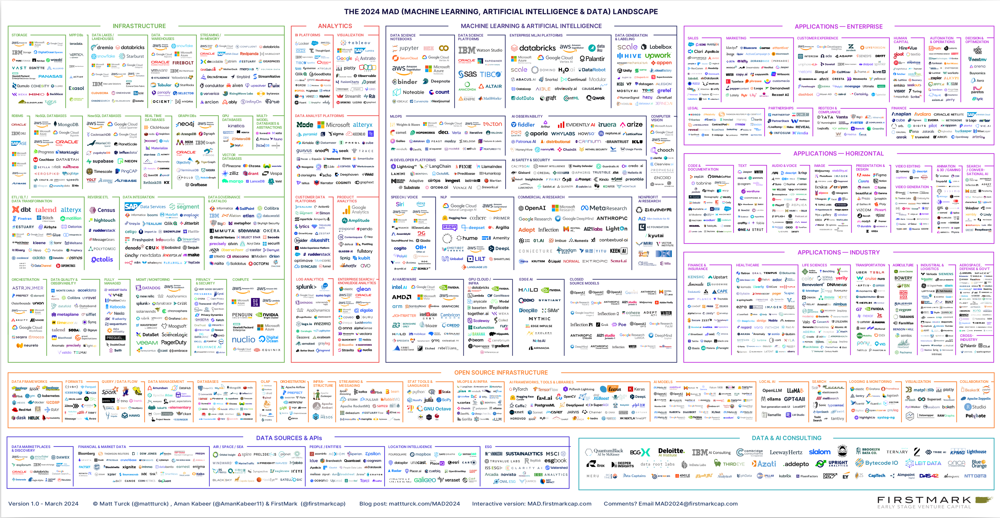
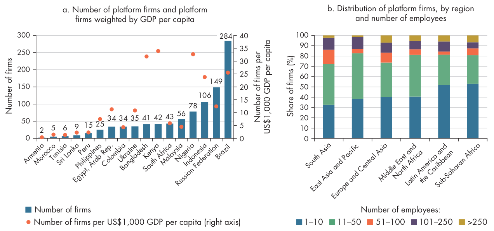
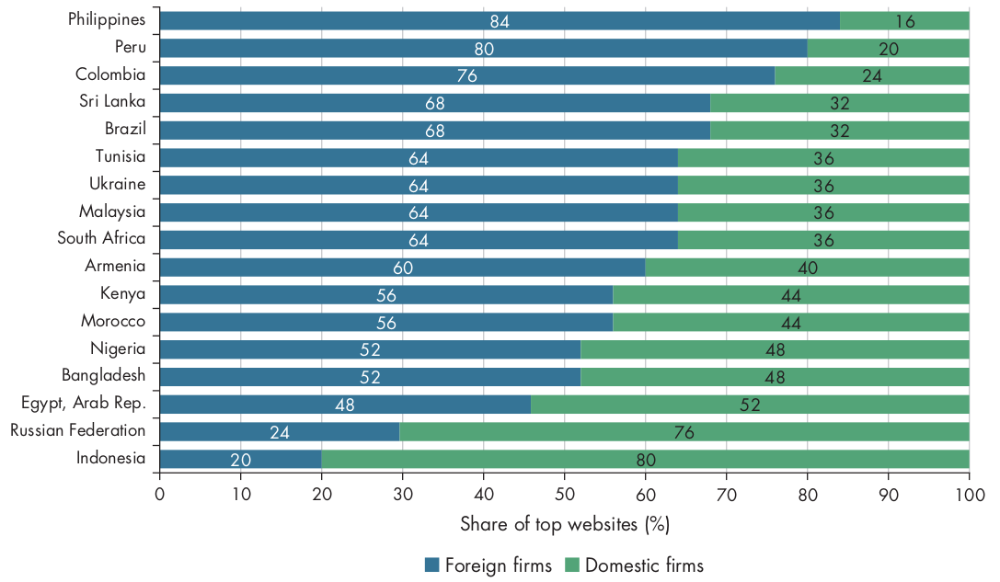
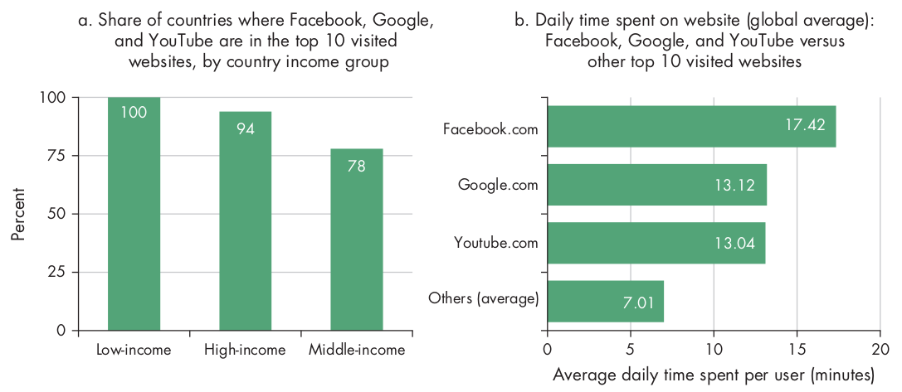
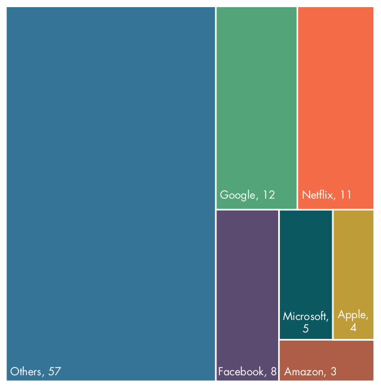
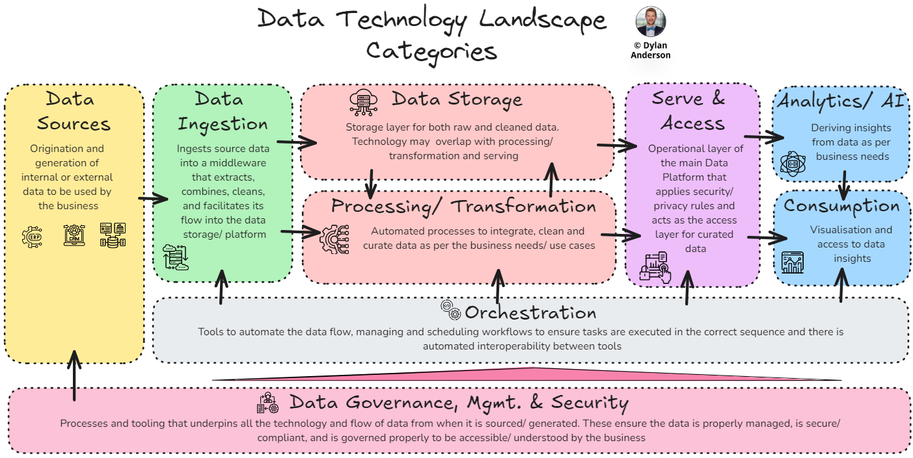

## {.center}

{fig-align="center"}

## Số lượng công cụ và công nghệ dữ liệu{.center}

:::: {.columns}

::: {.column width="50%"}

- Năm 2012, có khoảng**139**ứng dụng/công cụ/nền tảng liên quan đến dữ liệu.

- Đến năm 2023, con số này đã tăng lên khoảng**1\.416**.

- Đến năm 2024, con số này đã tăng lên hơn**2000**.

:::

::: {.column width="50%"}

{fig-align="center"}

:::

::::

## Công nghệ và phương pháp hỗ trợ ra quyết định dựa trên dữ liệu

- Công nghệ hỗ trợ phân tích dữ liệu quy mô lớn: trí tuệ nhân tạo, bao gồm học máy

- Công nghệ thu thập dữ liệu và cung cấp thông tin từ phân tích: các thiết bị thông minh và thiết bị kết nối qua Internet of Things (IoT)

- Công nghệ tạo ra tính minh bạch và niềm tin trong hồ sơ dữ liệu: công nghệ sổ cái phân tán, bao gồm blockchain

## Các công ty nền tảng tại các quốc gia có thu nhập thấp và trung bình{.center}

{fig-align="center"}

## Các doanh nghiệp trong nước so với các doanh nghiệp có trụ sở nước ngoài{.center}

{fig-align="center"}

## Người dùng dành nhiều thời gian hơn trên Facebook, Google và YouTube{.center}

{fig-align="center"}

## Lưu lượng truy cập Internet tại các quốc gia có thu nhập thấp và trung bình{.center}

{fig-align="center"}

## Vòng đời dữ liệu{.center}

{fig-align="center"}

## Bản đồ công nghệ dữ liệu{.center}

{fig-align="center"}

