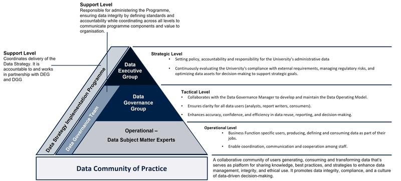
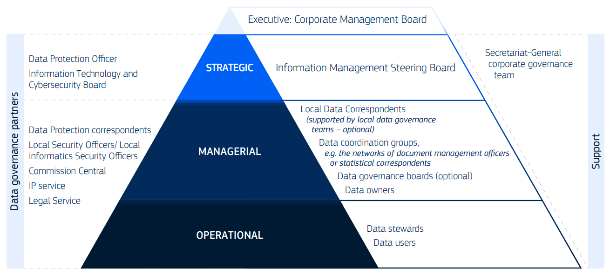

## Mô hình vai trò và trách nhiệm về dữ liệu - Đại học Oxford {.center}

{fig-align="center"}

## Nhóm Điều hành Dữ liệu

- Cung cấp hướng dẫn chiến lược tổng thể và ra quyết định thông qua:
  
  - Xây dựng chính sách, trách nhiệm giải trình và trách nhiệm đối với dữ liệu hành chính của Đại học.
  
  - Đánh giá liên tục khả năng của Đại học trong việc đáp ứng các nghĩa vụ bên ngoài và giảm thiểu rủi ro pháp lý và quy định, đồng thời tối đa hóa giá trị của dữ liệu để đưa ra quyết định có căn cứ và hỗ trợ các mục tiêu chiến lược.

## Nhóm Quản trị Dữ liệu

- Giám sát các chính sách quản trị và đảm bảo chúng được tuân thủ thông qua:
  
  - Đảm bảo Mô hình Hoạt động Dữ liệu và các hoạt động quản trị và chất lượng dữ liệu cốt lõi cung cấp hướng dẫn rõ ràng cho tất cả người dùng dữ liệu, dù họ phân tích, báo cáo hay sử dụng dữ liệu.
  
  - Hỗ trợ cải thiện độ chính xác, độ tin cậy và hiệu quả trong việc tái sử dụng dữ liệu, báo cáo và ra quyết định.

## Chuyên gia về dữ liệu {.smaller}

- Xử lý dữ liệu trong các vai trò hàng ngày của họ như tạo, sử dụng, lưu trữ, định nghĩa, quản lý hoặc xóa dữ liệu. Họ chịu trách nhiệm:
  
  - Báo cáo tiến độ và thách thức trong quản trị dữ liệu cho Nhóm Quản trị Dữ liệu.
  
  - Đảm bảo tính toàn vẹn và bảo mật của dữ liệu, tuân thủ các chính sách tổ chức và yêu cầu pháp lý.
  
  - Áp dụng các thực hành tốt nhất, duy trì chất lượng dữ liệu, giải quyết các vấn đề liên quan đến dữ liệu và hỗ trợ báo cáo chính xác, kịp thời.
  
  - Thúc đẩy hợp tác giữa các đội ngũ kinh doanh và kỹ thuật để hỗ trợ việc ra quyết định dựa trên dữ liệu một cách hiệu quả.

## Mô hình vai trò và trách nhiệm về dữ liệu - OECD {.center}

{fig-align="center"}

## Vai trò của nhóm - Ban chỉ đạo quản lý thông tin

- Nhóm công tác thường trực của Hội đồng Quản trị Doanh nghiệp.

- Hỗ trợ Ban Điều hành giám sát việc triển khai chiến lược quản lý dữ liệu, thông tin và kiến thức của Ủy ban, với sự hỗ trợ từ Nhóm Quản lý Thông tin.

::: {.notes}

- Chủ trì và phê duyệt chiến lược dữ liệu doanh nghiệp, khung quản trị dữ liệu và chính sách dữ liệu.

- Xem xét các chính sách dữ liệu địa phương đồng thời cho phép các bộ phận linh hoạt điều chỉnh phương pháp của riêng mình.

- Xác định ưu tiên cho các hành động của tập đoàn và thúc đẩy hợp tác trong việc triển khai chiến lược.

- Ra quyết định chiến lược mà không thể giải quyết ở cấp quản lý hoặc vận hành.

- Giám sát việc thực hiện chính sách và phối hợp với các đối tác quản trị dữ liệu khi cần thiết.

- Khuyến khích các thực hành quản trị dữ liệu mạnh mẽ và tạo sự minh bạch cho các sáng kiến liên quan.

- Yêu cầu các bộ phận và đối tác quản trị dữ liệu đóng góp để hỗ trợ hoặc triển khai các chính sách dữ liệu.

- Tư vấn cho Ban Công nghệ Thông tin và An ninh Mạng về các vấn đề liên quan đến chính sách dữ liệu.

- Xem xét các nguồn lực con người và tài chính cần thiết cho việc phát triển và duy trì quản trị dữ liệu và chính sách.

:::

## Nhóm vai trò - Nhóm điều phối dữ liệu {.smaller}

- Phát triển, triển khai, giám sát và thúc đẩy các chính sách dữ liệu trong phạm vi trách nhiệm của mình, phù hợp với quản trị dữ liệu của công ty.

- Tạo ra và khuyến khích sử dụng metadata chung, từ vựng kiểm soát và tiêu chuẩn dữ liệu cho lĩnh vực dữ liệu của mình.

- Cung cấp hướng dẫn, báo cáo tiến độ và nâng cấp các vấn đề lên lãnh đạo chiến lược khi cần thiết.

- Kết nối nhu cầu kinh doanh và chính sách với tài sản dữ liệu, và xác định các lỗ hổng dữ liệu ở cấp độ công ty, giữa các bộ phận hoặc địa phương.

- Hợp tác với các nhóm và đối tác quản trị khác để hỗ trợ hoặc triển khai các chính sách và hành động dữ liệu cụ thể.

- Cung cấp hỗ trợ và chia sẻ chuyên môn với chủ sở hữu dữ liệu, người quản lý dữ liệu và nhân viên khác trong phạm vi trách nhiệm của mình.

::: {.notes}

- Các ủy ban, mạng lưới và cộng đồng khác nhau đã được thành lập để cải thiện sự phối hợp trong các vấn đề dữ liệu và hỗ trợ việc triển khai các chính sách dữ liệu trong Ủy ban.

- Các nhóm này hoạt động như **các nhóm phối hợp dữ liệu** trong khung quản trị dữ liệu doanh nghiệp.

- Một nhóm điều phối dữ liệu có thể là bất kỳ cơ quan chính thức hoặc không chính thức nào tập trung vào các chủ đề liên quan đến dữ liệu và phải có nhiệm vụ rõ ràng được phê duyệt bởi các DG/dịch vụ yêu cầu.

- Một số nhóm là vĩnh viễn, trong khi những nhóm khác hoạt động trong thời gian giới hạn.

- IMSB giám sát tất cả các nhóm hiện có và nên được tham khảo ý kiến trước khi thành lập các nhóm mới.

:::

## Vai trò của nhóm - Ban quản trị dữ liệu {.smaller}

- Hỗ trợ việc triển khai hiệu quả các chính sách và quản trị dữ liệu của công ty.

- Đảm bảo các chính sách dữ liệu địa phương được xây dựng và phù hợp với hướng dẫn của công ty.

- Theo dõi mức độ trưởng thành của bộ phận trong quản trị, quản lý và sử dụng dữ liệu.

- Khuyến khích quản trị dữ liệu, sử dụng dữ liệu (bao gồm báo cáo, phân tích và trí tuệ nhân tạo) và nâng cao nhận thức về dữ liệu ở tất cả các cấp độ tổ chức.

- Tư vấn về nguồn lực con người và tài chính cần thiết để phát triển, triển khai và duy trì quản trị dữ liệu và chính sách dữ liệu.

## Vai trò cá nhân - Đại diện dữ liệu địa phương

- Là điểm liên hệ chính cho quản lý dữ liệu trong bộ phận/dịch vụ của mình.

- Vai trò này có thể được chia sẻ hoặc giao cho nhiều người tùy thuộc vào quy mô và nhu cầu của bộ phận.

- Các DG/dịch vụ có thể thành lập các nhóm quản trị dữ liệu địa phương để hỗ trợ triển khai quản trị dữ liệu và chính sách dữ liệu, đồng thời cung cấp hỗ trợ cho các LDC.

## Vai trò cá nhân - Chủ sở hữu dữ liệu

- Chủ sở hữu dữ liệu là các nhà quản lý hoặc nhân viên được lãnh đạo chiến lược chỉ định để chịu trách nhiệm về một lĩnh vực dữ liệu cụ thể hoặc tài sản dữ liệu.

- Thuật ngữ này đề cập đến chủ sở hữu dữ liệu trong kinh doanh, không phải chủ sở hữu hoặc nhà cung cấp hệ thống IT.

- Mỗi tài sản dữ liệu phải có chủ sở hữu dữ liệu được chỉ định rõ ràng.

- Các lĩnh vực dữ liệu cũng có thể có một hoặc nhiều chủ sở hữu được chỉ định.

## Vai trò cá nhân - Quản trị viên dữ liệu

- Người quản lý dữ liệu là các chuyên gia về lĩnh vực dữ liệu hoặc tài sản dữ liệu cụ thể.

- Họ được bổ nhiệm bởi và hỗ trợ chủ sở hữu dữ liệu được chỉ định.

- Quản trị viên dữ liệu có thể hoạt động ngoài đơn vị tổ chức của mình nếu cần thiết.

- Họ thường hợp tác với các kiến trúc sư dữ liệu chuyên môn trong các nhiệm vụ như mô hình hóa dữ liệu và truyền đạt yêu cầu dữ liệu cho các đội ngũ IT.

## Các vai trò cá nhân - Người sử dụng dữ liệu {.smaller}

- **Nhân viên chính sách** sử dụng dữ liệu để hỗ trợ phát triển chính sách và ra quyết định.

- **Các nhà phân tích dữ liệu** phân tích, tích hợp và trực quan hóa dữ liệu để tạo ra các thông tin chi tiết.

- **Các kiến trúc sư dữ liệu hoặc thông tin** thiết kế mô hình và kiến trúc để quản lý và sử dụng dữ liệu.

- **Kỹ sư dữ liệu** chịu trách nhiệm làm sạch, tích hợp và chuẩn bị dữ liệu cho phân tích, đồng thời hỗ trợ xác định kiến trúc dữ liệu.

- **Nhà khoa học dữ liệu** phân tích các tập dữ liệu lớn bằng thống kê, phân tích nâng cao, học máy và trí tuệ nhân tạo để xác định các mẫu và thông tin chi tiết.

- **Nhân viên** phát triển **phần mềm** xây dựng các đường ống dữ liệu, triển khai kiến trúc dữ liệu, tạo giao diện truy cập dữ liệu và tích hợp chính sách dữ liệu vào hệ thống IT.

