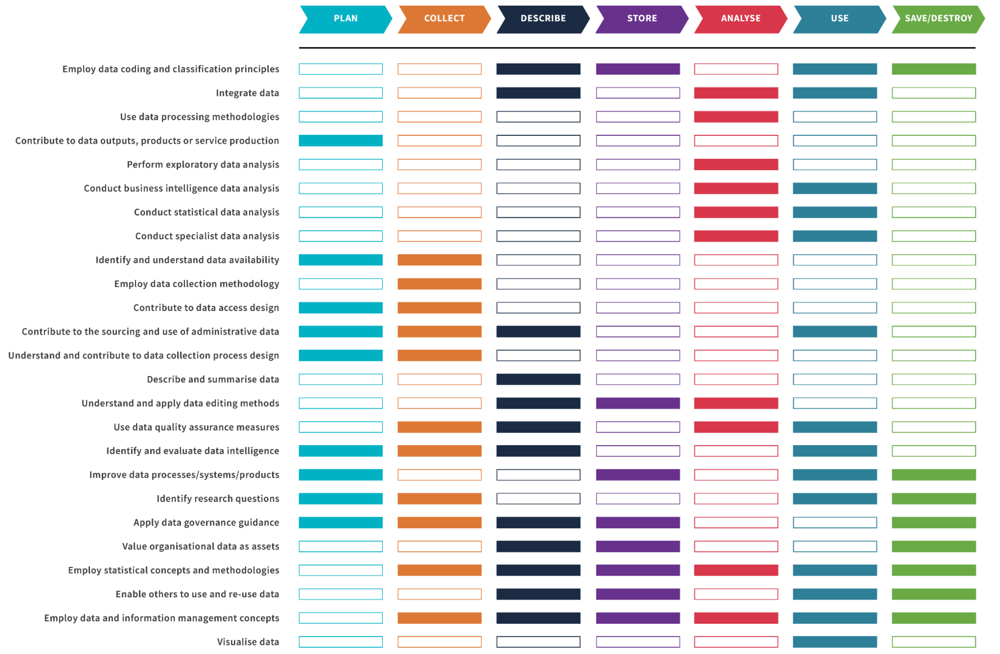
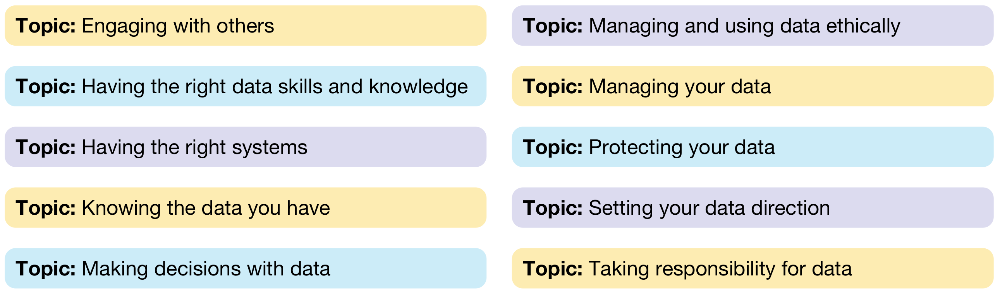
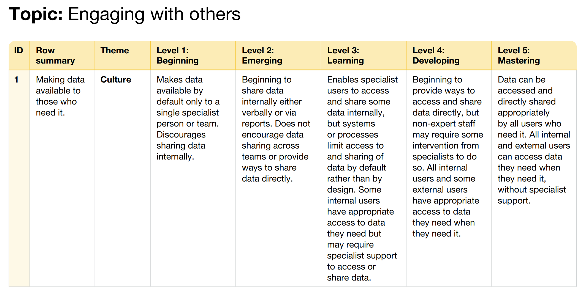
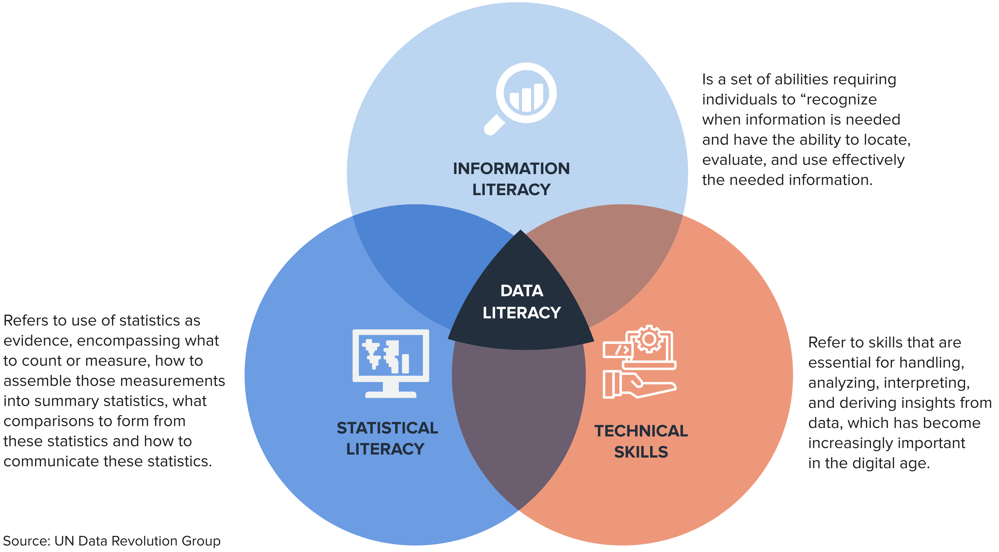
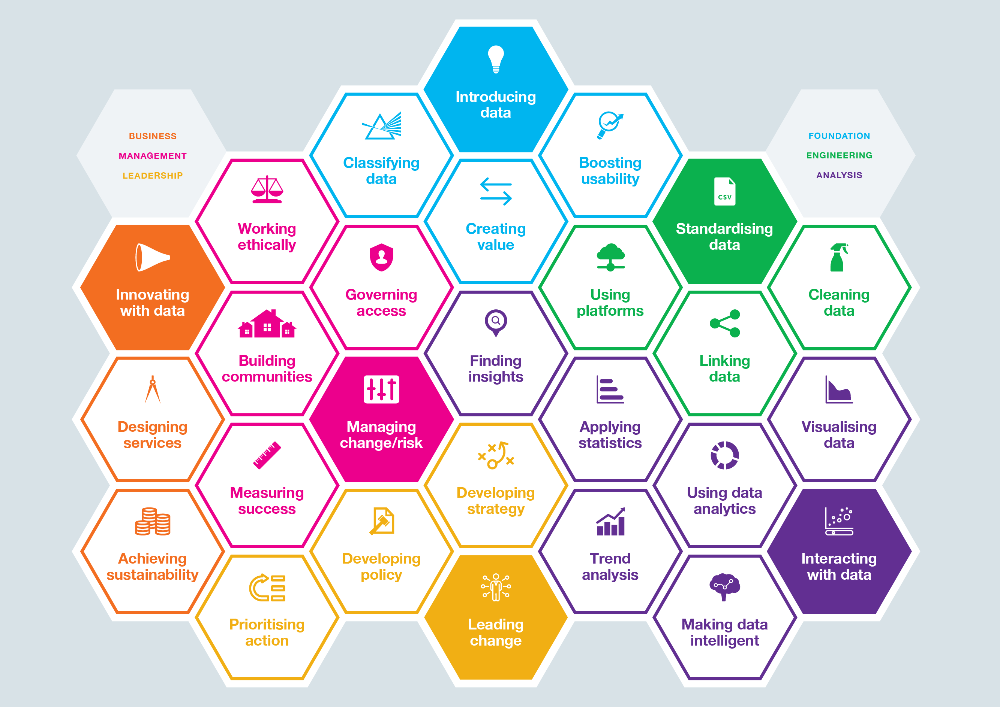

## Building data capacity

* Not everyone needs to be a data scientist.

* Data capacities in policymaking refer to how well infrastructure, systems, and people can use data effectively for decisions.

* Strengthening these abilities across different teams is essential.

* Complementary skill sets help reinforce the entire data value chain and improve overall decision-making.

## 1. Identify gaps in data skills and statistical capacities {.center background-color="#002147"}

## Types of skills {.center}

{fig-align="center"}

## Data Capability Framework {.center}

{fig-align="center"}

## Data Capability Framework - example {.smaller}

* **Capability:** Employ data coding and classification principles

* **Catgory:** Describe, Store, Use, and Save/Destroy

:::: {.columns}

::: {.column width="33.3%"}
### New

* Is aware of relevant data classifications and coding protocols, and their proper application to data in general.

* Knows who to consult for expert knowledge.
:::

::: {.column width="33.3%"}

### Proficient

* Has a comprehensive knowledge of data classifications and coding protocols.

* Knows where to obtain expert advice about coding and classifications as needed.

:::

::: {.column width="33.3%"}

### Expert

* Is consulted regularly by others about data classifications and coding protocols.

* Can employ conceptual frameworks in support of data classification and coding.

:::

::::

## Data Capability Framework Guide {.center}

{fig-align="center"}

[Link](https://data.govt.nz/toolkit/data-capability-framework/data-capability-framework-guide)

## Data Maturity Assessment Framework {.center}

{fig-align="center"}

## Data Maturity Assessment Framework

* **Themes:** Uses, Data, Leadership, Culture, Tools, Skills

* **Maturity Levels:** Beginning, Emerging, Learning, Developing, Mastering

## Data Maturity Assessment Framework - example {.center}

{fig-align="center"}

## Data Maturity Assessment Framework Guide {.center}

{fig-align="center"}

[Link](https://assets.publishing.service.gov.uk/media/64184bccd3bf7f79d9675dbd/Data_Maturity_Assessment_for_Government_-_FINAL_PDF.pdf)

## 2. Build data capacities in your team {.center background-color="#002147"}

## Data Literacy {.center}

{fig-align="center"}

## Data Skills Framework {.center}

{fig-align="center"}

## 3. Operationalise data capacity building {.center background-color="#002147"}

## Short-term

* Training workshops

* Online training resources

* Knowledge sharing on global innovations and use cases

## Medium-term

* Internal data champions

* Periodic data skills training

* ‍Pilot data projects

* ‍Build complementary skills with other stakeholders

* ‍Build on local knowledge and capacities

* ‍Build network of data practitioners across your organization

## Long-term

* Embed data skills in job roles

* Institutionalize data training programs

* ‍Partner with think tanks and external organizations

* ‍Partner with academia and local universities