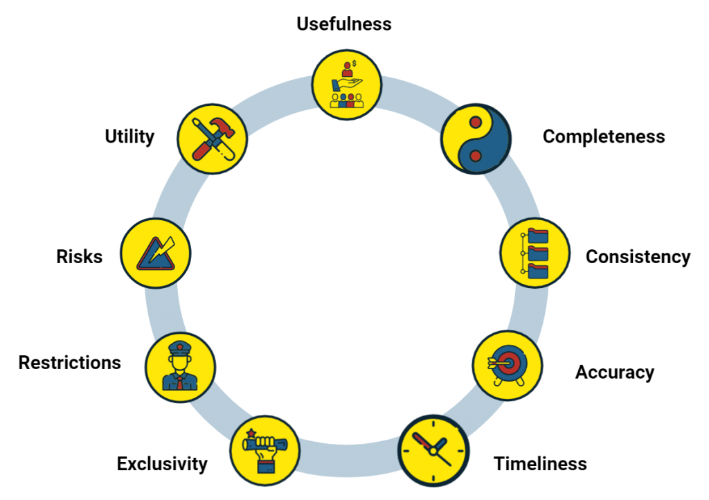
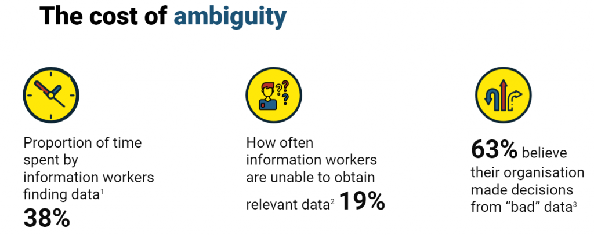
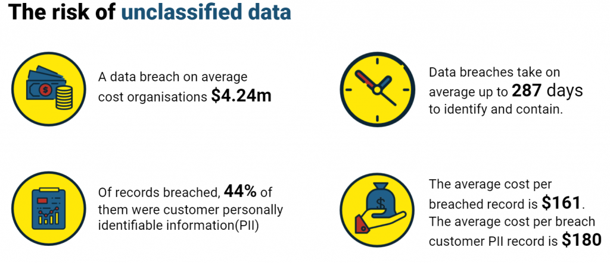

## Chi phí quản trị dữ liệu {.center background-color="#002147"}

## Chi phí cơ sở hạ tầng công nghệ

- Nền tảng quản trị dữ liệu: $50,000-$500,000+ mỗi năm

- Công cụ quản lý metadata: $40,000-$300,000 mỗi năm

- Công cụ quản lý chất lượng và phân tích dữ liệu: $30,000-$250,000 mỗi năm

- Giải pháp danh mục dữ liệu: $50,000-$400,000 mỗi năm

## Chi phí nhân sự

- Lương của Giám đốc Dữ liệu (Chief Data Officer): $175,000-$350,000+

- Quản lý quản trị dữ liệu: $120,000 - $180,000

- Chuyên viên quản lý dữ liệu: $85,000-$130,000 cho mỗi nhân sự

- Chuyên viên tuân thủ: $90,000-$150,000

## Phí triển khai và tư vấn

- Tư vấn triển khai ban đầu: $100,000-$500,000+

- Phát triển chiến lược: $50,000-$200,000

- Thiết kế chương trình: $75,000-$250,000

- Đào tạo và quản lý thay đổi: $30,000-$150,000

## Yêu cầu quản trị tuân thủ quy định

- Cụ thể theo ngành/lĩnh vực: tuân thủ quy định y tế; tuân thủ dịch vụ tài chính

- Yêu cầu tuân thủ chung
  
  - Ví dụ: Chi phí tuân thủ GDPR trung bình là $1,4 triệu cho các doanh nghiệp vừa
  
  - Bảo trì và cập nhật liên tục tăng thêm 30-40% hàng năm so với chi phí ban đầu

<!-- ## Yêu cầu kiểm toán -->

## Tối ưu hóa đầu tư vào quản trị dữ liệu {.center background-color="#002147"}

## Triển khai theo giai đoạn

- Ưu tiên các khả năng quản trị dựa trên yêu cầu về rủi ro và tuân thủ

- Bắt đầu với các lĩnh vực dữ liệu có rủi ro cao và mở rộng một cách có hệ thống.

## Giải pháp dựa trên đám mây

- Các nền tảng quản trị dữ liệu dựa trên đám mây thường cung cấp chi phí ban đầu thấp hơn và mô hình định giá dự đoán được hơn so với các giải pháp tại chỗ.

- Các tổ chức có thể giảm tổng chi phí sở hữu (CTO) từ 30-45% trong vòng năm năm thông qua các giải pháp quản trị dựa trên đám mây.

## Khung quản trị tích hợp

- Phát triển một phương pháp thống nhất để giải quyết đồng thời nhiều yêu cầu tuân thủ thay vì tạo ra các chương trình tuân thủ riêng lẻ.

- Điều này có thể giảm thiểu các biện pháp kiểm soát trùng lặp từ 25-40%.

## Tự động hóa và Trí tuệ nhân tạo

- Các công cụ quản trị được hỗ trợ bởi AI đang phát triển có thể giảm bớt nỗ lực thủ công trong việc phân loại dữ liệu, giám sát và khắc phục sự cố.

- Tự động hóa có thể giảm chi phí quản trị liên tục từ 20-35%.

## Tài trợ cho quản trị dữ liệu {.center background-color="#002147"}

## Sử dụng dữ liệu để cải thiện dòng tiền tự do

- Dữ liệu gây ra vấn đề gì cho dòng tiền?

- Hệ thống thủ công so với hệ thống tự động cho các quy trình lặp lại

- Chứng minh cách cải thiện quản trị có thể tăng hiệu quả

## Tăng doanh thu thông qua phân tích dữ liệu {.center}

:::: {.columns}

::: {.column width="50%"}

- Đánh giá giá trị của dữ liệu và tận dụng giá trị này

- Tăng sự hài lòng của khách hàng thông qua dữ liệu

:::

::: {.column width="50%"}

{fig-align="center"}

:::

::::

## Giảm chi phí thông qua việc tối ưu hóa dữ liệu {.center}

{fig-align="center"}

- Khoảng 530.000 ngày làm việc của quản lý bị lãng phí do dữ liệu chất lượng kém và không được ghi chép (tương đương với khoảng $250 triệu tiền lương hàng năm)

- Chỉ cần ghi chép metadata của bạn có thể giảm chi phí liên quan đến dữ liệu lên đến 97%

## Giảm thiểu rủi ro với dữ liệu {.center}

{fig-align="center"}

- Rủi ro tuân thủ quy định (ví dụ: phạt tiền theo GDPR)

- Rủi ro an ninh mạng (cả chi phí ứng phó và sự suy giảm niềm tin của khách hàng)

## Tạo nguồn tài chính từ dữ liệu

- Sử dụng đánh giá giá trị dữ liệu để xác định các phần của doanh nghiệp nơi dữ liệu có thể tăng doanh thu, giải phóng dòng tiền hoặc giảm chi phí và rủi ro.

- Điều này cung cấp cho bạn cơ sở cụ thể để thảo luận với ban lãnh đạo về việc đầu tư vào cải thiện dữ liệu.

- Thay vì yêu cầu ngân sách mà không có bằng chứng, bạn tiếp cận Giám đốc Tài chính (CFO) với lý do chính đáng, dựa trên dữ liệu.

- Việc huy động vốn cho quản trị dữ liệu trở nên dễ dàng hơn nhiều khi các lợi ích tài chính được hiểu rõ ràng.

