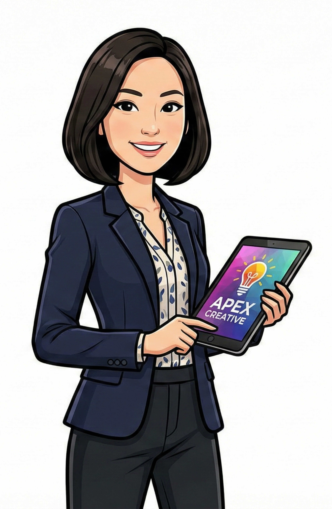
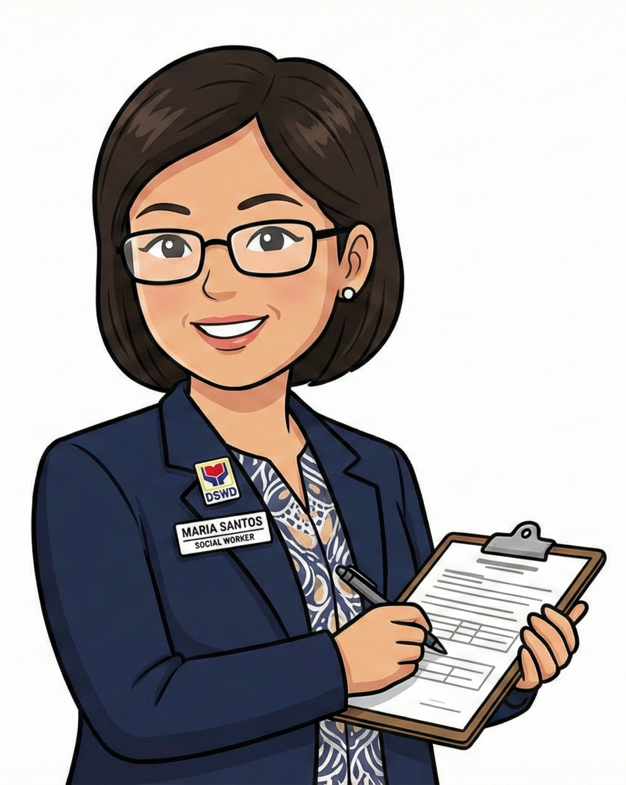
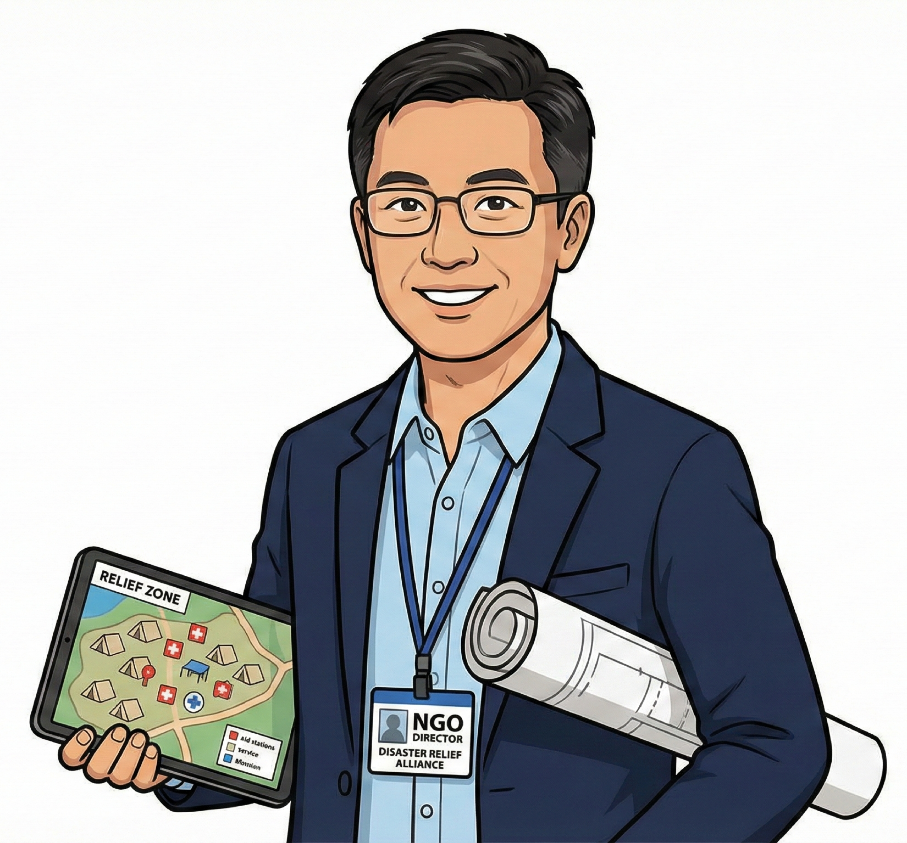

## Persona 1: Quyen {.center background-color="#002147"}

## {.center .smaller}

:::: {.columns}

::: {.column width="50%"}

* Quyen has recently been appointed as the youngest Director of Innovations for a private utilities company

* The company is the oldest and largest provider of water and electricity utilities in the area.

* The company still uses manual collection of water and electricity metre readings.

* The company also uses archaic rules for determining where to position resources for installing new water and electrical lines.

* Within a year, Quyen aims to modernise the way the company provides its services to its customers

:::

::: {.column width="50%"}

{fig-align="center"}

:::

::::

## Persona 2: Phúc {.center background-color="#002147"}

## {.center .smaller}

:::: {.columns}

::: {.column width="50%"}

{fig-align="center"}

:::

::: {.column width="50%"}

* Phúc is a mid-career researcher/academic in a prestigious university within a department that has research units working on topics on health and the environment.

* Over the past 5 years, Phúc and his small team of researchers used air quality logs from a network of sensors they've put in place throughout the area along with additional area-based data on vehicular traffic and locations of factories and other industrial plants to assess air quality and its determinants.

* Moving forward, Phúc wants to expand his research into the connections between poor air quality and poor health outcomes by linking the datasets he has been able to put together on air quality with his departmental colleagues' data on health and health outcomes.

:::

::::

## Persona 3: Maria {.center background-color="#002147"}

## {.center .smaller}

:::: {.columns}

::: {.column width="50%"}

* Maria has been a government social worker for the past 30 years in the Poverty Alleviation Unit which she now leads as Director.

* Over the years, Maria has noticed a steady increase in the number of families needing welfare support from her unit.

* However, whilst her unit has complete records of all the families supported over the years, they are all on paper.

* Maria would like to be able to use the data the unit has on the families to be able to better understand the clients and their needs.

:::

::: {.column width="50%"}

{fig-align="center"}

:::

::::

## Persona 4: Lục {.center background-color="#002147"}

## {.center .smaller}

:::: {.columns}

::: {.column width="50%"}

{fig-align="center"}

:::

::: {.column width="50%"}

* Lục leads a non-governmental organisation that provides support to families affected by natural disasters.

* In every disaster that the organisation responds to, records for each individual and family supported are meticulously curated using a phone-based app for digital data collection deployed through each of their field workers.

* Lục would like to make this data available to respective government departments so that it can be used for further analytics that can provide insight into responses to future disasters.

:::

::::

