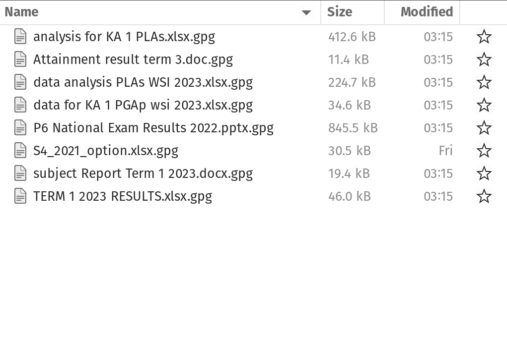

## Who, what, when, where, why, and how of data {.center background-color="#002147"}

::: {.notes}

When going through these five case studies, it is recommended to first go through them using the who, what, when, where, how, and why framework as a way to get a firm grounding on the case study details.

The “who, what, when, where, how, and why” framework is a systematic approach to understanding and analysing data. Another term that can be used for this framework is descriptive metadata which is data that provides information about other data, but not the content itself. So, if I have an image, the metadata wouldn’t be the actual picture, but the details about who took it, when, or where.

Here’s a structured explanation of each component within this framework:

:::

## Who

* who owns the data;
* who manages the data;
* who collects the data;
* who stores the data; and,
* who protects/safeguards the data.

::: {.notes}

Refers to the individuals or entities involved with the data. This includes stakeholders, users, customers, employees, or business partners who interact with or are affected by the data. More specifically, this may include, among others, information on:

who owns the data;
who manages the data;
who collects the data;
who stores the data; and,
who protects/safeguards the data.

:::

## What

* what the data is about; 
* type, nature, and provenance; 
* specifies the information available, such as numerical data, text, images, etc.

::: {.notes}

Describes what the data is about and its type, nature, and provenance. It specifies what information is available, such as numerical data, text, images, etc., which helps in understanding the scope and relevance of the data, and how to work with the data.

:::

## When

* timing;
* period; and/or,
* frequency

::: {.notes}

Pertains to the timing, period, and/or frequency in which the data was/is being collected, recorded, or analysed.

:::

## Where

* location where the data is stored or accessed

    * database;
    * server;
    * external sources

::: {.notes}

Indicates the location where the data is stored or accessed. This could be within a database, on a server, or even from external sources like devices or sensors, providing context about data accessibility and storage.

:::

## How

Methods used to:

* collect;
* process;
* extract

::: {.notes}

Focuses on the methods used to collect, process, or extract the data. This includes techniques such as surveys, sensor readings, or existing records, which helps in understanding how reliable and comprehensive the data is.

:::

## Why

* purpose behind collecting and analysing the data;
* guides appropriate actions based on the stated purpose

::: {.notes}

Asks for the purpose behind collecting and analysing the data. It clarifies why this information is being gathered i.e., whether it’s for reporting, decision-making, monitoring performance, or other objectives. This in turn guides appropriate actions based on the data insights.

:::

## Group exercise {.center background-color="#002147"}

## Data systems {.center background-color="#002147"}

## Data systems (analogy)

:::: {.columns}

::: {.column width="50%"}
{fig-align="center"}
:::

::: {.column width="50%"}
**The 400-year old problem:**

What is the best way to stack a collection of spherical objects, such as a display of oranges for sale?
:::

::::

## Data systems (analogy)

{width=600}

## Data systems

Data systems involve platforms that manage and store data effectively such as **databases** (relational or non-relational), **data lakes** holding large volumes, **big data systems** for massive datasets, and **business intelligence tools** for analytics.

## Data system as an organising framework for

* Most effective and efficient data structure for ...

* Most appropriate data types required/needed ...

* Formatted in a data format that is most compliant and compatible ...

## Data Privacy, Security, and Protection {.center background-color="#002147"}

## Data privacy and protection {.center}

**Data privacy** is the protection of personal information, ensuring individuals have control over how their data is collected, stored, and used. It encompasses the principles and practices that govern how sensitive data, especially personal data, is handled, including _collection_, _retention_, _deletion_, and _access_. 

## Principles of data privacy and protection

* The key principles of data protection ensure that personal data is handled responsibly and ethically. These principles are essential for protecting individuals' privacy and rights while also enabling organisations to use data effectively. 

* The core principles are: _lawfulness, fairness, and transparency_; _purpose limitation_; _data minimisation_; _accuracy_; _storage limitation_; _integrity and confidentiality_; and _accountability_.

## Lawfulness, Fairness, and Transparency

* There should be a legal basis for collecting and using personal data (_lawfulness_)

* Handling personal data in ways that people would reasonably expect, and not using it in ways that cause them unjustified harm (_fairness_)

* Requires that any information and communication relating to the processing of personal data be easily accessible and easy to understand, and that clear and plain language be used (_transparency_)

## Purpose limitation

* Personal data should only be collected for _specified_, _explicit_, and _legitimate_ purposes and not further processed in a manner that is incompatible with those purposes.

* specific purposes for which personal data are processed should be _explicit_ and _legitimate_ and determined at the time of the collection of the personal data.

## Data minimisation

* Processing of personal data must be adequate, relevant, and limited to what is necessary in relation to the purposes for which they are processed. 

* Personal data should be processed only if the purpose of the processing could not reasonably be fulfilled by other means. 

* This is linked to the principle of **Storage limitation**

## Accuracy

* Ensure that personal data are accurate and, where necessary, kept up to date; taking every reasonable step to ensure that personal data that are inaccurate, having regard to the purposes for which they are processed, are erased or rectified without delay. 

* Accurately record information collected or receive and the source of that information.

## Storage limitation

* Personal data should only be kept in a form which permits identification of data subjects for as long as is necessary for the purposes for which the personal data are processed. 

* In order to ensure that the personal data are not kept longer than necessary, time limits should be established by the controller for erasure or for a periodic review.

## Integrity and confidentiality

* Protection against unauthorised or unlawful access to or use of personal data and the equipment used for the processing and against accidental loss, destruction or damage, using appropriate technical or organisational measures.

## Accountability

* Take responsibility for the processing of personal data and how they comply with the above principles

* Demonstrate (through appropriate records and measures) compliance

## Legal frameworks

* General Data Protection Regulation - UK and EU

* For Vietnam???

* These frameworks follow the same principles described earlier

## Data security

* The practice of protecting digital information from unauthorised access, use, disclosure, disruption, modification, or destruction.

* Encompasses various measures and techniques to ensure the confidentiality, integrity, and availability of data throughout its lifecycle. 

* Includes securing physical hardware, software, storage devices, and user devices, as well as implementing access controls, policies, and procedures.

## Layers of data security

* Personal/individual layer - us as individuals responsible for the security of our own personal information and any other information that we own or are responsible for.

## Layers of data security

* Institutional layer

    * institutions responsible for the security of the personal information of its own employees and/or members/affiliates
    * institutions responsible for the security of the personal information of others from whom they collect information from as part of the service they render.
    * institutions responsible for the security of other types of information that they own or are responsible for

## Data tools {.center background-color="#002147"}

## Data tools 

* Our choice of tools or the tools that we are made to use dictate how we implement the different steps in the data management pathway as such also influence the resulting quality of data that we obtain

* Since every step of the data pathway used by the course participants involve Microsoft Excel, this tool has the greatest influence in the data quality of the current ecosystem of data in Seychelles

## The dangers of spreadsheets

* The danger is real. The [European Spreadsheet Risks Interest Group](https://eusprig.org/) keeps a public archive of spreadsheet [“horror stories”](https://eusprig.org/research-info/horror-stories/){target="_blank"}.

* Many researchers have examined error rates in spreadsheets. In 13 audits of real-world spreadsheets, an average of 88% contained errors.

* Microsoft Excel specifically converts some combination of character and numbers to dates and stores dates differently between operating systems, which can cause problems in downstream analyses.

## The dangers of spreadsheets

* Spreadsheets are often used as a multi-purpose tool for data entry, storage, analysis, and visualisation.

* Spreadsheets, by design, make humans format data to be viewed by the human eye rather than to be readable by a machine.

## Spreadsheets are best suited to data entry and storage {.center}

## Specific recommendations for organising spreadsheet data in a way that both humans and computer programs can read {.center}

## Be consistent

* Use consistent codes for categorical variables

* Use a consistent fixed code for missing values

* Use consistent variable names

* Use consistent identifiers

* Use consistent layout in multiple data files

## Be consistent

* Use consistent file names

* Use consistent format for dates (ideally ISO format - YYYY-MM-DD)

* Use consistent phrases

* Be careful about extra spaces in cells

## Choose good names for things

* Do not use spaces in variables names and file anmes

* Avoid special characters

* Short but meaningful

## Write dates as YYYY-MM-DD

* recommend using the global “ISO 8601” standard, YYYY-MM-DD

* Microsoft Excel’s treatment of dates can cause problems in data. It stores them internally as a number, with different conventions on Windows and Macs. So, you may need to manually check the integrity of your data when they come out of Excel.

## No empty cell {.center}

## Put just one thing in a cell {.center}

## Make it a rectangle {.center}

## Create a data dictionary {.center}

## No calculations in the raw data file {.center}

## Do not use font colour or highlighting as data {.center}

## Make backups {.center}

## Use data validation to avoid errors {.center}

We discuss validity errors specifically later in this slide deck.

## Save the data in plain text files {.center}

## Other formatting issues with Excel can be found [here](https://datacarpentry.github.io/spreadsheet-ecology-lesson/02-common-mistakes){target="_blank"} {.center}

## We need to talk about data cleaning {.center}

**Data cleansing** or **data cleaning** is the process of identifying and correcting (or removing) corrupt, inaccurate, or irrelevant records from a dataset, table, or database. It involves detecting incomplete, incorrect, or inaccurate parts of the data and then replacing, modifying, or deleting the affected data.

## But how do we know that our data has errors?

* It depends on the data and it depends on what kind of error you are looking for

* Most of the time, when we say we are performing data cleaning, we are looking for or spotting **errors of validity**

* Validity in terms of data is the degree to which the values conform to defined rules or constraints. In general such errors can be spotted "by eye"

## Validity errors

* Data type errors - values in a particular column must be of a particular data type

* Range errors - numbers or dates should fall within a certain range

* Missing values errors - missing values particularly when a value is required

* Unique value errors

## Validity errors

* Set membership errors - values should only be from a specific set of possible values

* Expected value errors

* Cross-field validation - the value in one field determines what is correct or incorrect value in another field (example: pregnant male)

## Validity errors often due to data entry errors/issues {.center}

## But not all errors can be detected "by eye"

* Some _validity errors_ and errors of _accuracy_, _consistency_, _uniformity_, and _distribution_ requires exploratory data analysis to be detected.

* We will discuss these errors next week omn our topic on exploratory data analysis.

## We need to talk about data re-structuring

* **Data restructuring** refers to manipulating existing data to make it more suitable for analysis, storage, or other purposes. It involves changing the format, structure, or organisation of data to align with specific needs, such as data warehousing or statistical analysis.

* This is another type of data cleaning and is sometimes called **"data tidying"**

## Data structure - Example 1

The table has two columns and three rows, and both rows and columns are labelled.

&nbsp;       | treatmenta | treatmentb
------------:|-----------:|----------:
John Smith   | &nbsp;     | 2
Jane Doe     | 16         | 11
Mary Johnson | 3          | 1

## Data structure - Example 2

Rows and columns have been transposed. The data is the same, but the layout is different.

&nbsp;       | John Smith  | Jane Doe  | Mary Johnson
------------:|------------:|----------:|------------:
treatmenta   | &nbsp;      | 16        | 3
treatmentb   | 2           | 11        | 1

## Data semantics

* A dataset is a collection of **values**, usually either numbers (if quantitative) or strings (if qualitative). 

* **Values** are organised in two ways: 

    * Every _value_ belongs to a **variable** and an **observation**. 
    * A **variable** contains all values that measure the same underlying attribute (like height, temperature, duration) across units. 
    * An **observation** contains all values measured on the same unit (like a person, or a day, or a race) across attributes.

## Data structure - Example 3

name         | treatment | result
-----------: | :-------- | -----:
John Smith   | a         |  
Jane Doe     | a         | 16
Mary Johnson | a         | 3
John Smith   | b         | 2
Jane Doe     | b         | 11
Mary Johnson | b         | 1

* The same data as earlier but with variables in columns and observations in rows.

## Data structure - summary

* For a given dataset, it’s usually easy to figure out what are **observations** and what are **variables**, but it is surprisingly difficult to precisely define variables and observations in general.

* A general rule of thumb is that it is easier to describe **functional relationships** between variables than between observations (rows), and it is easier to make **comparisons** between groups of observations than between groups of columns.

## The standard of tidy data

* Provides a standard way to organise data values within a dataset.

* Designed to facilitate initial exploration and analysis of the data, and to simplify the development of data analysis tools.

* Principles of tidy data are closely tied to those of relational databases

## Tidy data definition

* Tidy data is a standard way of mapping the meaning of a dataset to its structure.

* A dataset is messy or tidy depending on how rows, columns and tables are matched up with observations, variables and types.

## Tidy data criteria

1. Each variable forms a column.

2. Each observation forms a row.

3. Each type of observational unit forms a table.

## Five most common problems with messy datasets

* Column headers are values not variable names

* Multiple variables are stored in one column

* Variables are stored in both rows and columns

* Multiple types of observational units are stored in the same table.

* A single observational unit is stored in multiple tables.

## Tidy data is extremely compatible with relational databases and data collection tools that adhere to relational database standards {.center}

## Messy data is commonly a result of the use of data tools that do not have standards or set rules for data structure i.e., Microsoft Excel {.center}

## Project-based data workflow {.center background-color="#002147"}

## Mindset {.center}

As our skills as data analysts grow, the surrounding systems and infrastructure become crucial for ensuring the reproducibility and long-term preservation of our work. However, we often lack formal training or mentorship in managing such systems, leading us to either get lost amidst this technology or that we begin to explore these possibilities ourselves.

## Mindset {.center}

* With this short course in general and this second week specifically, we hope to help you gracefully fall into this gap.

* Don’t fret over past mistakes, but raise the bar for new work. Small but meaningful incremental changes add up over time, transforming your **data quality of life**.

## Livestock not pets {.center}

Think of your data processes as livestock and not pets.

::: {.notes}

Livestock is managed in herds and there is little fuss when individuals are lost or must be sacrificed. A pet, on the other hand, is unique and precious.

This is one of the limitations of spreadsheets in relation to creating a holistic data workflow. The tool combines the data, the code/steps, and the interface all in one software with an emphasis on just showing the end product/output to the user and the code/steps component hidden away. 

:::

## Project-oriented workflow {.center}

Organise work into projects.

## File system discipline

* Put all the files related to a single project in a designated folder.
* This applies to data, code, figures, notes, etc.
* Depending on project complexity, you might enforce further organization into subfolders.

## File naming {.center}

File organisation and naming are powerful weapons against chaos.

## Three principles for file names

:::: {.columns}

::: {.column width="70%"}

:::

::: {.column width="30%"}

* machine-readable

* human-readable

* plays well with default ordering

:::

::::

## Machine-readable

* avoid spaces, punctuation, accented, characters, case sensitivity.

* deliberate use of delimiters/space-holders - `"_"` or `"-"`

     * general rule is that `"_"` to delimit units of metadata while `"-"` to delimit words so that they are more readable.

## Machine-readable

* easy to search for files later
* easy to narrow file lists based on names
* easy to extract information from file names

## Human-readable

* name contains info on content.
* use the concept of a **slug** used in URLs.

## Human-readable {.center}

Easy to figure out what something is based on its name

## Plays well with default ordering

* put something numeric first

* use ISO 8601 standard for dates

* add leading zeros to numbers

## Three principles for file names

* easy to implement now

* payoffs accumulate as your skills evolve and projects get more complex