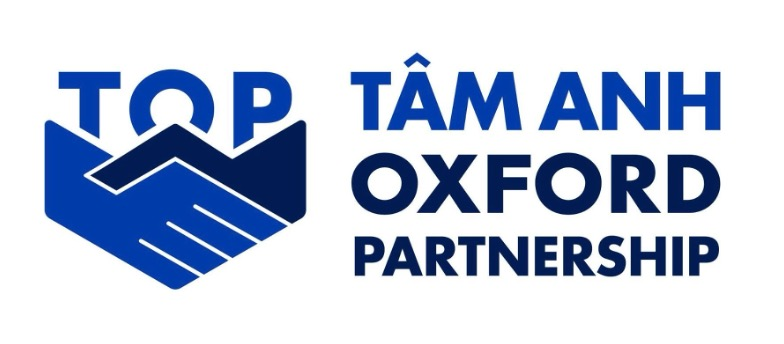

## About Tam Anh Oxford Partnership (TOP) {#sec-about-top}

In January 2025, the [Tâm Anh Research Institute](https://tamri.vn/en/) and the [International Health and Tropical Medicine Group](https://www.tropicalmedicine.ox.ac.uk/study-with-us/msc-ihtm), [Centre for Global Health Research](https://www.tropicalmedicine.ox.ac.uk/research/ndm-cghr), [Nuffield Department of Medicine](https://www.ndm.ox.ac.uk/) launched a new partnership.
The collaboration aims to build a sustainable, demand-driven model focused on non-communicable diseases and preventive healthcare, with strong emphasis on capacity sharing through expert exchange and reciprocal training.
Led by Vietnamese priorities and supported by local private-sector funding, the partnership seeks to ground research in Vietnam’s healthcare needs while leveraging Oxford’s global expertise to translate evidence into national policy, creating a balanced and innovative approach to global health collaboration.

## About the TOP Capacity Development Courses {#sec-about-top-courses}

The [Tâm Anh Oxford Partnership (TOP)](https://tamri.vn/en/events/tam-anh-oxford-partnership/) has organised intensive training courses on strengthening research capacity and data governance for scientists and managers in Vietnam.
The first set of these training courses were on *Introduction to Research Design* and on *Data Concepts and Applications*.

### Introduction to Research Design {#sec-research-design-course}

This course is a foundational training programme that aims to strengthen core research capacity among healthcare professionals.
Upon completion, participants will be able to proactively propose ideas, design and implement high-quality studies grounded in solid scientific principles, ethical standards, data governance and methodological rigour.

The **Introduction to Research Design** course was developed to support participants in:

-   Navigating peer-reviewed literature to inform research​;

-   Formulating research questions to address identified research gaps​;

-   Devising appropriate methodology to answer the research question(s)​;

-   Identifying or planning the collection of and managing data needed to address research question(s)​;

-   Characterising relevant ethical issues related to their research and devising mitigation plan​; and,

-   Engaging with different audiences to disseminate research outcomes.

Within this course, one day was allocated to the topic of *Research Data Management*.
Following is the presentation/slide deck presented for that topic.

#### Research Data Management

Presentation/Slide deck: {.external target="_blank"} 
{.external target="_blank"}

### Data Concepts and Applications {#sec-data-concepts-applications}

In a context where data is increasingly becoming the foundation of all management and operational decision-making, managers must not only understand data but also be able to use it systematically and strategically.
The course "Data Concepts and Applications for Managers" is specifically designed for mid-level managers and leaders.
The course provides a solid foundation in data, data governance frameworks and practical applications, enabling managers to build, operate and oversee reliable data systems, providing the basis for accurate, transparent and long-term decision-making.

The following core topics were covered:

-   Analyse global and regional data governance models;

-   Identify gaps in Vietnam’s technological and human resource readiness for data;

-   Formulate strategies to bridge policy and practice;

-   Apply guiding principles for ethical and sustainable data frameworks;

-   Strengthen institutional capacity (managers) and national oversight capacity (leaders); and,

-   Build networks across management and leadership levels for collaborative governance.

#### Course outline {#sec-data-course-outline}

Presentation/Slide deck: {.external target="_blank"} 

#### Sessions {#sec-data-course-sessions}

| **Session** | **Links** |
|:-----------------------------------|:-----------------------------------|
| **Session 1:** Global landscape of data governance institutions and framework | {.external target="_blank"}  {.external target="_blank"} |
| **Session 2:** Case Study: The UK Data Landscape | {.external target="_blank"}  {.external target="_blank"} |
| **Session 3:** Case Study: Singapore’s Smart Nation, Open Government Products, and Singapore Government Tech Stack | {.external target="_blank"}  {.external target="_blank"} |
| **Session 4:** Case Study: The United Nations and its technological and data challenges | {.external target="_blank"}  {.external target="_blank"} |
| **Session 5:** Guiding principles on policymaking on national level data governance frameworks | {.external target="_blank"}  {.external target="_blank"} |
| **Session 6:** Best practices in setting up and implementing data governance structures | {.external target="_blank"}  {.external target="_blank"} |
| **Session 7:** Global landscape of available technologies for data | {.external target="_blank"}  {.external target="_blank"} |
| **Session 8:** The landscape of technologies for data in Vietnam | {.external target="_blank"}  {.external target="_blank"} |
| **Session 9:** Global landscape of human resources for data | {.external target="_blank"}  {.external target="_blank"} |
| **Session 10:** The landscape of human resources for data in Vietnam | {.external target="_blank"}  {.external target="_blank"} |
| **Session 11:** Guiding principles and best practices for data capacity building | {.external target="_blank"}  {.external target="_blank"} |
| **Session 12:** Financing data governance | {.external target="_blank"}  {.external target="_blank"} |
| **Session 13:** Manager personas for successful building and implementation of data governance structures and frameworks for Vietnam | {.external target="_blank"}  {.external target="_blank"} |

**All sessions slides combined:** 

## Contributors {#sec-top-contributors}

### Trần Đào Quyên {#sec-contributor-quyen}

Tâm Anh Oxford Partnership (TOP) Strategic Programme Lead\
University of Oxford

-   Editor and co-facilitator of the session on *Research Data Management* for the *Introduction to Research Design* course.

### Trần Công Minh {#sec-contributor-minh}

Tâm Anh Oxford Partnership (TOP) Senior Research Fellow for Innovation\
University of Oxford

-   Author of session on *Research Data Management* for the *Introduction to Research Design* course.

-   Editor and co-facilitator of the sessions for the *Data Concepts and Applications for Managers* course.

### Đinh Thị Thu Huyền {#sec-contributor-huyen}

Tâm Anh Research Institute

-   Editor and co-facilitator of the session on *Research Data Management* for the *Introduction to Research Design* course.

-   Editor and co-facilitator of the sessions for the *Data Concepts and Applications for Managers* course.

### Chu Tấn Huy {#sec-contributor-huy}

Tâm Anh Research Institute

-   Editor and co-facilitator of the session on *Research Data Management* for the *Introduction to Research Design* course.

-   Editor and co-facilitator of the sessions for the *Data Concepts and Applications for Managers* course.

### Ernest Guevarra {#sec-contributor-ernest}

Senior Research and Teaching Associate\
University of Oxford

-   Author and facilitator of the session on *Research Data Management* for the *Introduction to Research Design* course.

-   Author and facilitator of the sessions for the *Data Concepts and Applications for Managers* course.

### Proochista Ariana {#sec-contributor-proochista}

Associate Professor / Tâm Anh Oxford Partnership Programme Director\
University of Oxford

-   Capacity development project lead

-   Editor of the session on *Research Data Management* for the *Introduction to Research Design* course.

-   Editor of the sessions for the *Data Concepts and Applications for Managers* course.

-   Co-facilitator of *Session 13: Manager personas for successful building and implementation of data governance structures and frameworks for Vietnam* for the *Data Concepts and Applications for Managers* course.

### Phương Lễ Trí {#sec-contributor-tri}

Chief Operating Officer\
Tâm Anh Research Institute

-   Capacity development project lead

## License {#sec-license}

All presentations/slide decks are released under a [CC-BY-4.0](https://creativecommons.org/licenses/by/4.0/deed.en) license.

[Source code](https://github.com/tamanh-oxford/capacity-development) developed to produce the various presentations/slide decks are released under a [GPL-3.0](https://www.gnu.org/licenses/gpl-3.0.en.html#license-text) license.

## Citation {#sec-citation}

### Citing the HTML presentations/slide decks {#sec-citation-html}

If you refer to/use the HTML presentations/slide decks for your work or research, please cite the appropriate presentation/slide deck using the metadata available from the [CITATION.cff](https://github.com/tamanh-oxford/capacity-development/blob/main/CITATION.cff) under the `references` tag.

### Citing the PDF presentations/slide decks {#sec-citation-pdf}

If you refer to/use the PDF presentations/slide decks for your work or research, please cite the appropriate presentation/slide deck using the metadata available from their respective Zenodo digital object identifiers (DOIs).

### Citing the source code {#sec-citation-source-code}

If you use the [source code](https://github.com/tamanh-oxford/capacity-development) developed to produce the various presentations/slide decks, please use the software metadata found in [CITATION.cff](https://github.com/tamanh-oxford/capacity-development/blob/main/CITATION.cff).

## Community guidelines {#sec-community}

Feedback, comments, and content requests are welcome; file issues or seek support [here](https://github.com/tamanh-oxford/capacity-development/issues).
If you would like to contribute to the development of these materials, please see our [contributing guidelines](https://github.com/tamanh-oxford/capacity-development/blob/main/.github/CONTRIBUTING.md).

Participants to the data capacity development courses are also welcome to join the [Data for Decision Makers](https://d4dm.org) community of practice on data and its use for transformative change.
This is an online community that mainly organises and communicates via [Zulip](https://zulip.com/) chat.
You can join and participate in the general community of practice through this [link](https://d4dm.zulipchat.com/join/w27up2ve4us2lwyyeck3pjay/).

This project and its community is governed by a [Contributor Code of Conduct](https://github.com/tamanh-oxford/capacity-development/blob/main/.github/CODE_OF_CONDUCT.md).
By participating in this project/community you agree to abide by its terms.
